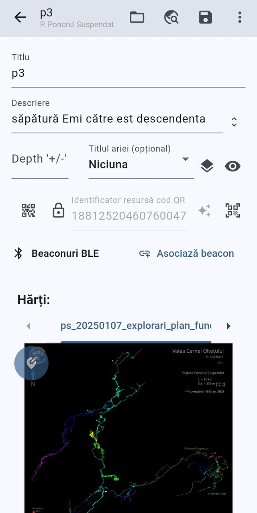
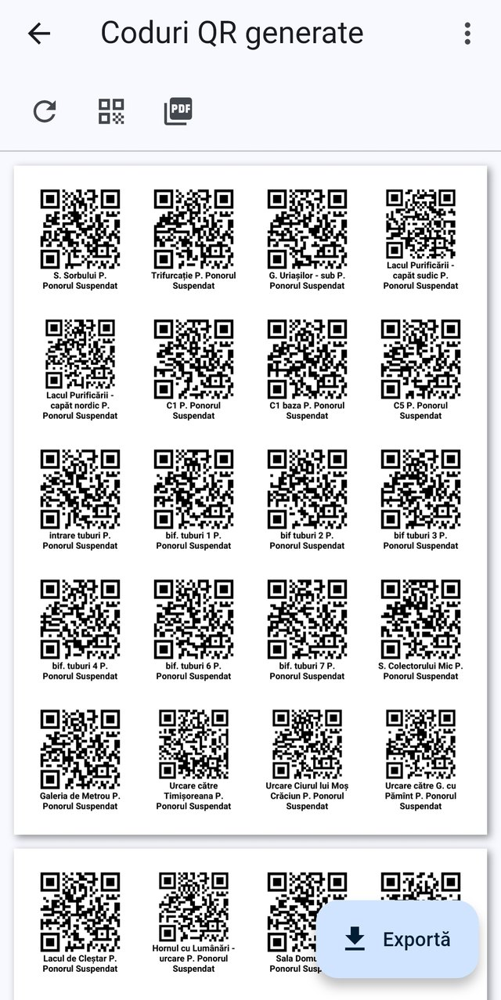
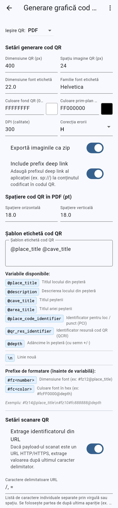

# Locuri din peșteră și coduri QR

[← Înapoi la galeria de capturi](README.md) · [← Înapoi la cuprins](../README.md)

Formularul locului din peșteră și generarea etichetelor QR tipăribile.

> Aplicația rulează implicit în **română**, așa că în capturile de ecran apar
> etichetele românești. Fiecare intrare listează formularea de pe ecran alături
> de echivalentul ei în engleză.

**Pe această pagină:** [Formularul locului din peșteră: coduri și beacon](#cave-place-form-codes-and-beacons) · [Previzualizarea etichetelor QR generate](#qr-labels-pdf-preview) · [Setări de generare QR](#settings-qr-generation)

---

## Formularul locului din peșteră: coduri și beacon

*Formularul locului din peșteră, derulat de la Titlu, prin Beaconuri BLE, până
la filele Hărți.*

Acesta este formularul complet al locului din peșteră pentru un loc deja
existent, capturat ca o singură derulare lungă. Blocul de sus conține Titlu,
Descriere, câmpul de adâncime și lista derulantă Titlul ariei (opțional), cu
Zonele peșterii și Afișează codul locului alături. Rândul următor este
Identificator resursă cod QR, flancat de Vizualizează cod QR, lacătul de
editare a codului QR, Generează automat și Scanează. Sub el, secțiunea
Beaconuri BLE oferă Asociază beacon, pentru asocierea unui beacon la acest loc,
iar secțiunea Hărți este o bandă de file cu hărțile peșterii, fiecare filă
arătând imaginea hărții, astfel încât poziția locului să poată fi verificată
sau stabilită pe fiecare hartă. Bara de sus oferă Documente, Alege coordonatele
pe hartă și Salvează.

Textul de pe ecran (română → engleză)

- p3 — titlul locului din peșteră (bara de sus)
- P. Ponorul Suspendat — titlul peșterii părinte (subtitlul barei de sus)
- Documente — Documents (pictogramă dosar, bara de sus)
- Alege coordonatele pe hartă — Pick coordinates on map (pictogramă glob/căutare, bara de sus)
- Salvează — Save (pictogramă dischetă, bara de sus)
- Titlu — Title
- Descriere — Description
- Depth '+/-' — câmpul de adâncime în peșteră (eticheta nu este tradusă în aplicație)
- Titlul ariei (opțional) — Area title (optional), setat pe Niciuna — None
- Zonele peșterii — Cave areas (pictogramă straturi)
- Afișează codul locului — Show place code identifier (pictogramă ochi)
- Vizualizează cod QR — View QR code (pictogramă QR)
- Activează editarea codului QR — Enable QR edit (pictogramă lacăt)
- Identificator resursă cod QR — QR code resource identifier (valoarea 18812520460760047)
- Generează automat — Auto-generate (pictogramă sclipire)
- Scanează — Scan (pictogramă scaner QR)
- Beaconuri BLE — BLE beacons (antet de secțiune)
- Asociază beacon — Assign beacon
- Hărți: — Raster maps (antet de secțiune, cu câte o filă pentru fiecare hartă, de exemplu ps_20250107_explorari_plan_fund…)

**Descris în:** [Locuri din peșteră](../features/cave-places.md) · [Beaconuri BLE](../features/ble-beacons.md)

---

## Previzualizarea etichetelor QR generate

*Previzualizarea foii cu etichete QR generate, înainte de export.*

După generarea etichetelor QR pentru un set de locuri din peșteră, acest ecran
previzualizează documentul rezultat — o foaie de coduri QR care se derulează și
se mărește prin ciupire, fiecare cod fiind printat cu textul de etichetă
construit din șablonul etichetei (aici titlul locului plus titlul peșterii, de
exemplu „C1 baza P. Ponorul Suspendat”). Bara de instrumente de deasupra
previzualizării oferă Regenerare PDF, Setări generare QR și Setări ieșire PDF;
întoarcerea din oricare dintre cele două pagini de setări regenerează
previzualizarea, așa că modificările de aspect se văd imediat. Butonul Exportă
din dreapta jos scrie fișierul finit, gata de partajat sau de printat.

Textul de pe ecran (română → engleză)

- Titlul barei de sus "Coduri QR generate" — "Generated QR Codes"
- Pictogramă de reîmprospătare: "Regenerare PDF" — "Regenerate PDF"
- Pictogramă QR: "Setări generare QR" — "QR Generation Settings"
- Pictogramă PDF: "Setări ieșire PDF" — "PDF Output Settings"
- Buton extins "Exportă" — "Export" (dreapta jos)
- Butonul de meniu suplimentar / meniul aplicației, dreapta sus
- Previzualizare paginată a cartonașelor cu etichete QR, fiecare cu textul dat de șablonul de etichetă (titlul locului + titlul peșterii)

**Descris în:** [Coduri QR](../features/qr-codes.md)

---

## Setări de generare QR

*Setările care controlează felul în care etichetele QR sunt desenate și
scanate.*

Această pagină de setări guvernează tot ce ține de etichetele QR generate:
tipul de ieșire QR (PDF sau Imagini), apoi, sub Setări generare cod QR,
dimensiunea QR, spațiul din jurul imaginii, dimensiunea și familia fontului
etichetei, culorile de fond și de prim-plan cu selectoare de culoare, DPI și
nivelul de corecție a erorii, plus comutatoarele Exportă imaginile ca zip și
Include prefix deep link. Mai jos, Spațiere cod QR în PDF stabilește distanțele
orizontale și verticale de pe foaia printată, iar Șablon etichetă cod QR
definește textul de sub fiecare cod, din variabile precum @place_title,
@cave_title, @place_code_identifier și @depth, cu prefixele #fz și #fc pentru
dimensiunea și culoarea fontului fiecărei variabile. Blocul final, Setări
scanare QR, controlează Extrage identificatorul din URL și caracterele
delimitatoare URL folosite atunci când conținutul scanat este o adresă web.
Fiecare câmp se salvează pe măsură ce este editat, iar pagina se deschide atât
din Setări, cât și din bara de instrumente a previzualizării codurilor QR
generate.

Textul de pe ecran (română → engleză)

- "Ieșire QR:" — "QR output:" listă derulantă, setată pe PDF (cealaltă valoare: "Imagini" — "Images")
- Secțiunea "Setări generare cod QR" — "QR Code generation settings"
- "Dimensiune QR (px)" — "QR size (px)", valoarea 400
- "Spațiu imagine QR (px)" — "QR image padding (px)", valoarea 24
- "Dimensiune font etichetă" — "Label font size", valoarea 22.0
- "Familie font etichetă" — "Label font family", valoarea Helvetica
- "Culoare fond QR (0xAARRGGBB)" — "QR background color (0xAARRGGBB)", FFFFFFFF, cu eșantion de culoare
- "Culoare prim-plan QR (0xAARRGGBB)" — "QR foreground color (0xAARRGGBB)", FF000000, cu eșantion de culoare
- "DPI (calitate)" — "DPI (quality)", valoarea 300
- "Corecția erorii" — "Error correction" listă derulantă, setată pe H
- Comutatorul "Exportă imaginile ca zip" — "Export images as zip" (pornit)
- Comutatorul "Include prefix deep link" — "Include deep link prefix" (pornit), cu text de ajutor despre adăugarea prefixului sp://
- Secțiunea "Spațiere cod QR în PDF (pt)" — "PDF QR code padding (pt)", cu "Spațiere orizontală" — "Horizontal padding" 18.0 și "Spațiere verticală" — "Vertical padding" 18.0
- Secțiunea "Șablon etichetă cod QR" — "QR code label template", conținând "@place_title @cave_title"
- "Variabile disponibile:" — "Available variables:" etichete: @place_title (Titlul locului din peșteră), @description (Descrierea locului din peșteră), @cave_title (Titlul peșterii), @area_title (Titlul ariei peșterii), @place_code_identifier (Identificator pentru loc / punct (PCI)), @qr_res_identifier (Identificator resursă cod QR (QCRI)), @depth (Adâncime în peșteră (cu semn +/-)), \n (Linie nouă)
- "Prefixe de formatare (înainte de variabilă):" — "Formatting prefixes (before a variable):" cu #fz<număr> (dimensiune font) și #fc<culoare> (culoare font în hex)
- Secțiunea "Setări scanare QR" — "QR scan settings"
- Comutatorul "Extrage identificatorul din URL" — "Strip URL to identifier" (pornit)
- "Caractere delimitatoare URL" — "URL delimiter characters", valoarea "/, ="
- Butonul de meniu suplimentar / meniul aplicației, dreapta sus

**Descris în:** [Setări](../features/settings.md) · [Coduri QR](../features/qr-codes.md)

---

[← Înapoi la galeria de capturi](README.md)
