# Sincronizare și partajare

[← Înapoi la indexul capturilor](README.md) · [← Înapoi la cuprins](../README.md)

Schimbul manual de arhive, istoricul modificărilor și sincronizarea FTP/SFTP,
de la profil până la rularea încheiată.

> Aplicația rulează implicit în **română**, deci capturile arată etichetele în română. Fiecare intrare listează textul de pe ecran alături de echivalentul lui în engleză.

**Pe această pagină:** [Sincronizare manuală — fila arhivă](#sync-dashboard-archive-tab) · [Sincronizare manuală — fila istoric modificări](#sync-dashboard-change-log-tab) · [Lista profilurilor FTP](#ftp-sync-profile-list) · [Editarea unui profil FTP](#ftp-sync-profile-edit) · [O încărcare care începe](#ftp-sync-upload-start) · [O încărcare în desfășurare](#ftp-sync-upload-running) · [O încărcare pe sfârșite](#ftp-sync-upload-finishing) · [O sincronizare încheiată](#ftp-sync-complete) · [Fila jurnal de sincronizare](#ftp-sync-log-tab) · [Fila istoric modificări în timpul unei sincronizări](#ftp-sync-change-log-tab) · [O intrare de istoric desfășurată](#ftp-sync-change-log-details)

---

## Sincronizare manuală — fila arhivă

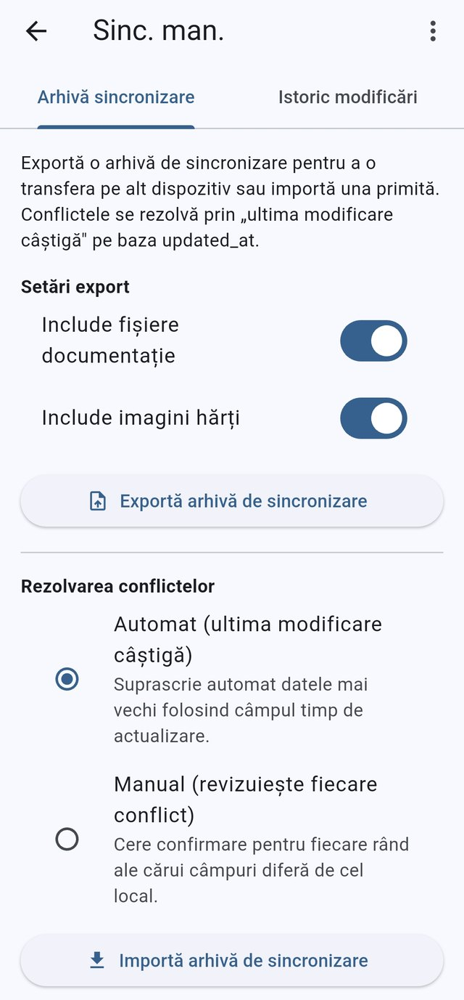

*Fila Arhivă sincronizare: setările de export, rezolvarea conflictelor și
acțiunea de import.*

Fila Arhivă sincronizare din panoul Sinc. man., unde se produce sau se citește
înapoi o arhivă de sincronizare între dispozitive. Sub Setări export,
comutatoarele Include fișiere documentație și Include imagini hărți decid ce
intră în zip, iar Exportă arhivă de sincronizare o scrie pe disc. Rezolvarea
conflictelor alege între Automat (ultima modificare câștigă), care suprascrie
automat datele mai vechi folosind câmpul timp de actualizare, și Manual
(revizuiește fiecare conflict), care cere confirmare pentru fiecare rând
diferit; Importă arhivă de sincronizare îmbină apoi o arhivă primită după
regula aleasă.

Textul de pe ecran (română → engleză)

- Sinc. man. — Man. sync (titlu în bara de aplicație)
- Arhivă sincronizare — Archive sync (fila selectată)
- Istoric modificări — Change log (filă)
- Setări export — Export Settings (titlu de secțiune)
- Include fișiere documentație — Include documentation files (comutator, pornit)
- Include imagini hărți — Include raster map images (comutator, pornit)
- Exportă arhivă de sincronizare — Export sync archive (buton)
- Rezolvarea conflictelor — Conflict resolution (titlu de secțiune)
- Automat (ultima modificare câștigă) — Automatic (last writer wins) (buton radio, selectat)
- Suprascrie automat datele mai vechi folosind câmpul timp de actualizare. — Silently overwrite older entries using the updated_at timestamp. (subtitlu de buton radio)
- Manual (revizuiește fiecare conflict) — Manual (review each conflict) (buton radio)
- Cere confirmare pentru fiecare rând ale cărui câmpuri diferă de cel local. — Prompt for each row whose fields differ from the local copy. (subtitlu de buton radio)
- Importă arhivă de sincronizare — Import sync archive (buton)
- Paragraful introductiv (sync_description) care explică regula „ultima modificare câștigă” după câmpul updated_at

**Descris în:** [Sincronizare și istoric modificări](../features/sync-and-change-log.md) · [Partajarea datelor](../workflows/sharing-data.md)

---

## Sincronizare manuală — fila istoric modificări

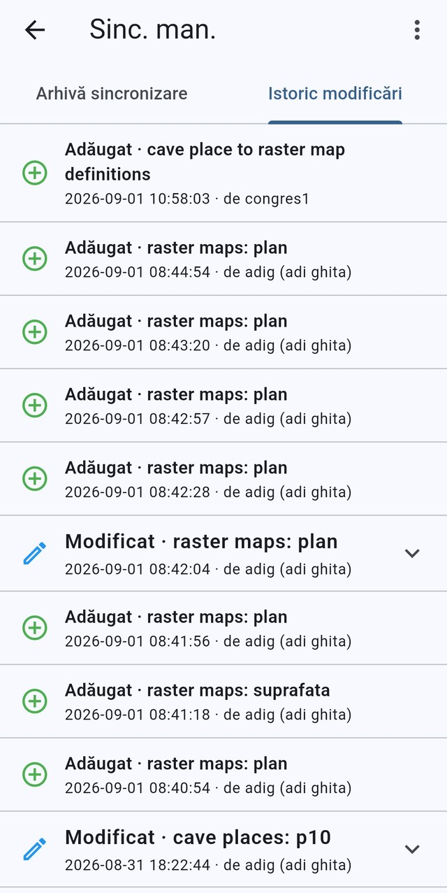

*Fila Istoric modificări, cu modificările recente ale înregistrărilor, autorul
și momentul lor.*

Fila Istoric modificări din panoul Sinc. man., o urmă de audit doar pentru
citire a fiecărei modificări de înregistrare consemnate pe acest dispozitiv.
Fiecare rând numește operația — Adăugat, cu o pictogramă plus verde, Modificat,
cu un creion albastru — urmată de tabelul și înregistrarea afectate, apoi
momentul și autorul, după de. Rândurile marcate Modificat au o săgeată de
desfășurare care deschide câmpurile schimbate, cu valorile lor vechi și noi.

Textul de pe ecran (română → engleză)

- Sinc. man. — Man. sync (titlu în bara de aplicație)
- Istoric modificări — Change log (fila selectată)
- Arhivă sincronizare — Archive sync (filă)
- Adăugat — Added (etichetă de rând, pictogramă plus verde)
- Modificat — Edited (etichetă de rând, pictogramă creion albastru, se poate desfășura)
- de — by (prefixul autorului din subtitlul rândului)
- Ținte de intrare precum „cave place to raster map definitions”, „raster maps: plan”, „cave places: p10”
- Momente de forma 2026-09-01 08:44:54, cu numele de utilizator adig (adi ghita) și congres1
- Săgeți de desfășurare pe rândurile modificate, care arată câmpurile schimbate

**Descris în:** [Sincronizare și istoric modificări](../features/sync-and-change-log.md)

---

## Lista profilurilor FTP

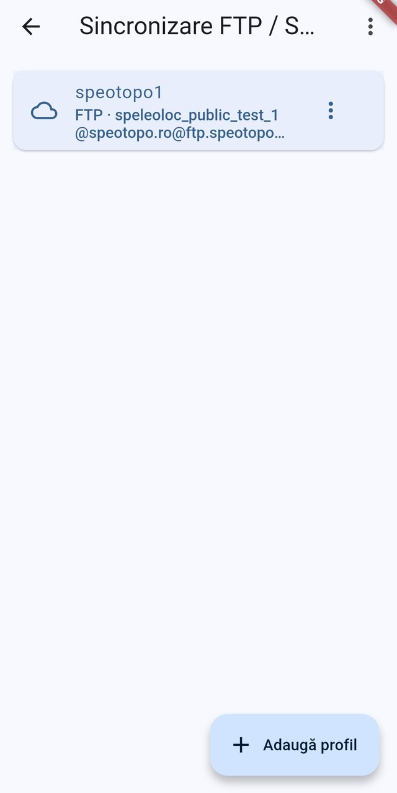

*Ecranul Sincronizare FTP / SFTP, cu profilurile de server configurate.*

Acest ecran administrează profilurile de server folosite pentru sincronizarea
FTP. Fiecare profil este un card cu pictograma protocolului, numele afișat al
profilului și un subtitlu care combină protocolul, utilizatorul, serverul,
portul și folderul de pe server; cardul evidențiat este profilul stabilit acum
ca implicit. Meniul suplimentar al fiecărui rând oferă Setează ca implicit,
Editează și Șterge, iar apăsarea unui card deschide editorul de profil. Butonul
Adaugă profil, din dreapta jos, creează un profil nou FTP, FTPS sau SFTP.

Textul de pe ecran (română → engleză)

- Sincronizare FTP / SFTP — FTP / SFTP sync (titlu în bara de aplicație, trunchiat)
- speotopo1 (numele afișat al profilului, pe cardul evidențiat al profilului implicit)
- FTP · speleoloc_public_test_1@speotopo.ro@ftp.speotopo… (subtitlu cu protocol, utilizator, server și folder)
- Adaugă profil — Add profile (buton de acțiune flotant extins)
- Meniul suplimentar al fiecărui rând: Setează ca implicit — Use as default, Editează — Edit, Șterge — Delete

**Descris în:** [Sincronizare FTP](../features/ftp-sync.md) · [Setări](../features/settings.md)

---

## Editarea unui profil FTP

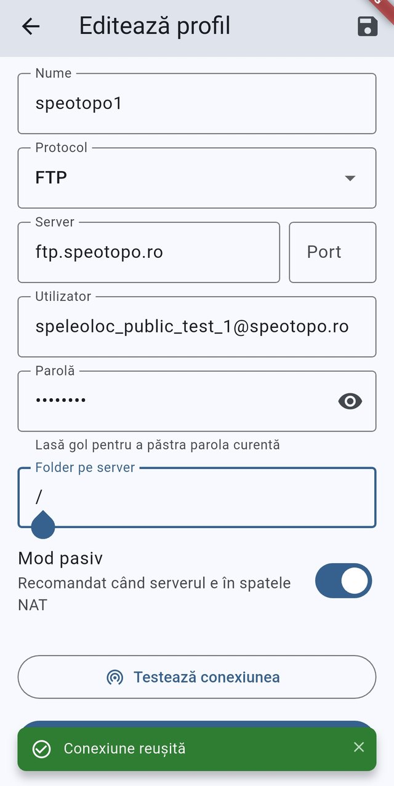

*Editarea unui profil de sincronizare FTP după un test de conexiune reușit.*

Editorul de profil FTP, la care se ajunge din Setări → Setări sincronizare FTP
apăsând un profil existent. Completați Nume, Protocol (FTP, FTPS sau SFTP),
Server și Port, Utilizator și Parolă, plus Folder pe server, folderul din care
aplicația citește și în care scrie arhivele; Mod pasiv este pornit, ceea ce se
recomandă când serverul e în spatele NAT. Apăsați Testează conexiunea pentru a
contacta serverul fără a salva, iar bara verde de notificare confirmă
„Conexiune reușită”. Pictograma de salvare din bara de aplicație stochează
profilul; dacă lăsați parola goală, se păstrează cea salvată.

Textul de pe ecran (română → engleză)

- Editează profil — Edit profile (titlu în bara de aplicație)
- pictograma de salvare din bara de aplicație — Save
- Nume — Name (valoare: speotopo1)
- Protocol — Protocol (listă derulantă, valoarea FTP)
- Server — Host (valoare: ftp.speotopo.ro)
- Port — Port (gol, valoarea implicită a protocolului)
- Utilizator — Username
- Parolă — Password (mascată, cu ochi pentru dezvăluire)
- Lasă gol pentru a păstra parola curentă — Leave blank to keep the current password
- Folder pe server — Remote folder (valoare: /)
- Mod pasiv — Passive mode (comutator, pornit)
- Recomandat când serverul e în spatele NAT — Recommended when the server is behind NAT
- Testează conexiunea — Test connection (buton)
- Conexiune reușită — Connection successful (bară de notificare de succes)

**Descris în:** [Sincronizare FTP](../features/ftp-sync.md) · [Setări](../features/settings.md)

---

## O încărcare care începe

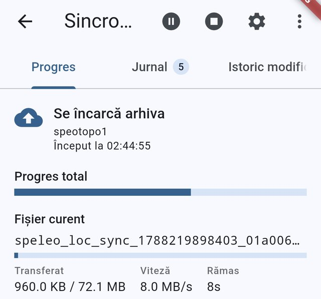

*Fila Progres la începutul încărcării unei arhive pe serverul FTP.*

Aceasta este fila Progres a ecranului Sincronizare FTP, în timp ce aplicația își
încarcă propria arhivă de sincronizare pe serverul comun. Antetul de fază spune
Se încarcă arhiva și numește profilul FTP folosit (speotopo1), plus ora de la
Început la, iar dedesubt bara Progres total și secțiunea Fișier curent arată
numele fișierului arhivă cu bara lui proprie și valorile Transferat / Viteză /
Rămas. Aici încărcarea abia a pornit, cu 960 KB trimiși dintr-o arhivă de
72.1 MB. Bara de aplicație are butoanele Pauză și Anulează sincronizarea, o
scurtătură către Setări sincronizare FTP și meniul aplicației, iar insigna filei
Jurnal arată 5 intrări până acum.

Textul de pe ecran (română → engleză)

- Sincronizare FTP — FTP sync (titlu în bara de aplicație, trunchiat pe ecran la „Sincro…”)
- Progres — Progress (fila selectată)
- Jurnal (insignă 5) — Log (filă, insigna numără intrările din jurnal)
- Istoric modificări — Change log (a treia filă, parțial tăiată)
- Se încarcă arhiva — Uploading archive (antet de fază, cu pictogramă de încărcare în cloud)
- speotopo1 — numele profilului FTP sincronizat
- Început la 02:44:55 — Started at 02:44:55
- Progres total — Overall progress (bară)
- Fișier curent — Current file (numele arhivei, plus bara pentru fișier)
- Transferat — Transferred (960.0 KB / 72.1 MB)
- Viteză — Speed (8.0 MB/s)
- Rămas — ETA (8s)
- Pauză — Pause sync (pictogramă în bara de aplicație)
- Anulează sincronizarea — Cancel sync (pictogramă în bara de aplicație)
- Setări sincronizare FTP — FTP sync settings (pictogramă rotiță)

**Descris în:** [Sincronizare FTP](../features/ftp-sync.md)

---

## O încărcare în desfășurare

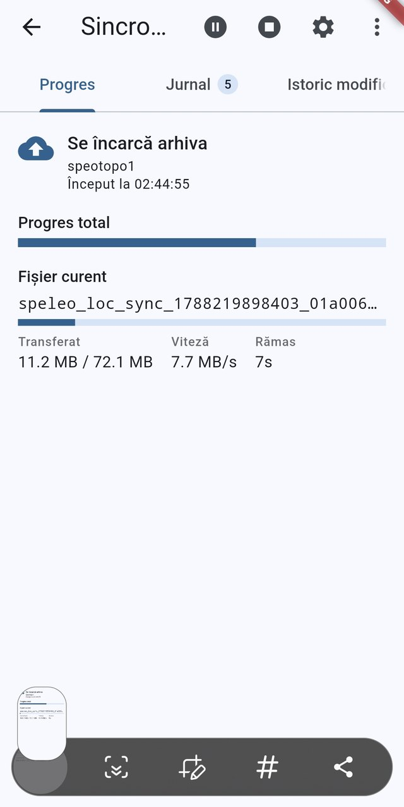

*Încărcarea arhivei în curs, cu valorile Transferat, Viteză și Rămas
actualizate în timp real.*

Aceeași filă Progres din Sincronizare FTP câteva secunde mai târziu, cu
încărcarea mergând constant: din arhiva de 72.1 MB s-au Transferat 11.2 MB, cu
7.7 MB/s, iar la Rămas scrie 7s. Atât bara Progres total, cât și bara pe fișier
de sub Fișier curent înaintează pe măsură ce se trimit octeți — așa vă
asigurați că transferul e viu, nu blocat. Pauză și Anulează sincronizarea rămân
disponibile în bara de aplicație pe tot parcursul transferului.

Textul de pe ecran (română → engleză)

- Sincronizare FTP — FTP sync (titlu în bara de aplicație, trunchiat pe ecran la „Sincro…”)
- Progres — Progress (fila selectată)
- Jurnal (insignă 5) — Log (filă, cu insignă care numără intrările)
- Istoric modificări — Change log (a treia filă, parțial tăiată)
- Se încarcă arhiva — Uploading archive (antet de fază)
- speotopo1 — numele profilului FTP sincronizat
- Început la 02:44:55 — Started at 02:44:55
- Progres total — Overall progress (bară)
- Fișier curent — Current file (numele arhivei speleo_loc_sync_…)
- Transferat — Transferred (11.2 MB / 72.1 MB)
- Viteză — Speed (7.7 MB/s)
- Rămas — ETA (7s)
- Pauză — Pause sync (pictogramă în bara de aplicație)
- Anulează sincronizarea — Cancel sync (pictogramă în bara de aplicație)

**Descris în:** [Sincronizare FTP](../features/ftp-sync.md)

---

## O încărcare pe sfârșite

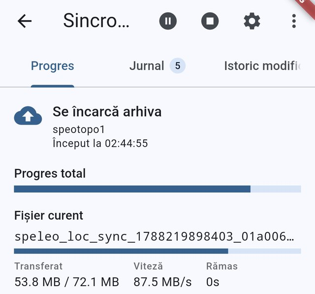

*Încărcarea aproape de final, ambele bare de progres aproape pline.*

Fila Progres din Sincronizare FTP, cu încărcarea arhivei aproape de final: s-au
Transferat 53.8 MB din 72.1 MB, Viteză a urcat la 87.5 MB/s, iar Rămas a scăzut
la 0s. Bara Progres total și bara Fișier curent sunt amândouă aproape pline, iar
ecranul va trece în faza Sincronizare reușită de îndată ce se încheie
transferul. De aici, fila Jurnal consemnează pas cu pas ce s-a întâmplat, iar
fila Istoric modificări arată modificările duse de sincronizare.

Textul de pe ecran (română → engleză)

- Sincronizare FTP — FTP sync (titlu în bara de aplicație, trunchiat pe ecran la „Sincro…”)
- Progres — Progress (fila selectată)
- Jurnal (insignă 5) — Log (filă, cu insignă care numără intrările)
- Istoric modificări — Change log (a treia filă, parțial tăiată)
- Se încarcă arhiva — Uploading archive (antet de fază)
- speotopo1 — numele profilului FTP sincronizat
- Început la 02:44:55 — Started at 02:44:55
- Progres total — Overall progress (bară aproape plină)
- Fișier curent — Current file (numele arhivei speleo_loc_sync_…)
- Transferat — Transferred (53.8 MB / 72.1 MB)
- Viteză — Speed (87.5 MB/s)
- Rămas — ETA (0s)
- Pauză — Pause sync (pictogramă în bara de aplicație)
- Anulează sincronizarea — Cancel sync (pictogramă în bara de aplicație)
- Setări sincronizare FTP — FTP sync settings (pictogramă rotiță)

**Descris în:** [Sincronizare FTP](../features/ftp-sync.md) · [Sincronizare și istoric modificări](../features/sync-and-change-log.md)

---

## O sincronizare încheiată

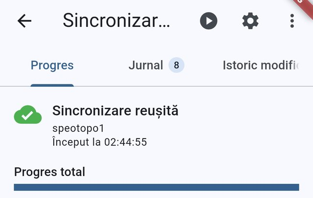

*Fila Progres după o rulare reușită a sincronizării FTP.*

Aceasta este fila Progres a ecranului Sincronizare FTP, chiar după încheierea
unei rulări. Antetul de fază spune Sincronizare reușită, cu o bifă verde pe nor,
numește profilul FTP folosit (speotopo1) și ora de la Început la, iar bara
Progres total este plină. Fiindcă nu rulează nimic, bara de aplicație oferă
Pornește sincronizarea (play), Setări sincronizare FTP (rotiță) și meniul
aplicației; în timpul unei sincronizări, acestea devin Pauză, Reia
sincronizarea și Anulează sincronizarea. Cele trei file — Progres, Jurnal și
Istoric modificări — rămân disponibile tot timpul.

Textul de pe ecran (română → engleză)

- Sincronizare FTP — FTP sync (titlu în bara de aplicație, trunchiat)
- Progres — Progress (filă, selectată)
- Jurnal 8 — Log (filă, cu o insignă care numără intrările din jurnal)
- Istoric modificări — Change log (filă)
- Sincronizare reușită — Sync complete (antet de fază)
- Început la 02:44:55 — Started at (ora de pornire a rulării)
- Progres total — Overall progress (bară de progres, plină)
- speotopo1 (numele profilului FTP care a fost sincronizat)
- Pornește sincronizarea — Start sync (pictogramă play în bara de aplicație)
- Setări sincronizare FTP — FTP sync settings (pictogramă rotiță în bara de aplicație)
- pictograma de meniu suplimentar care deschide sertarul cu meniul general al aplicației

**Descris în:** [Sincronizare FTP](../features/ftp-sync.md)

---

## Fila jurnal de sincronizare

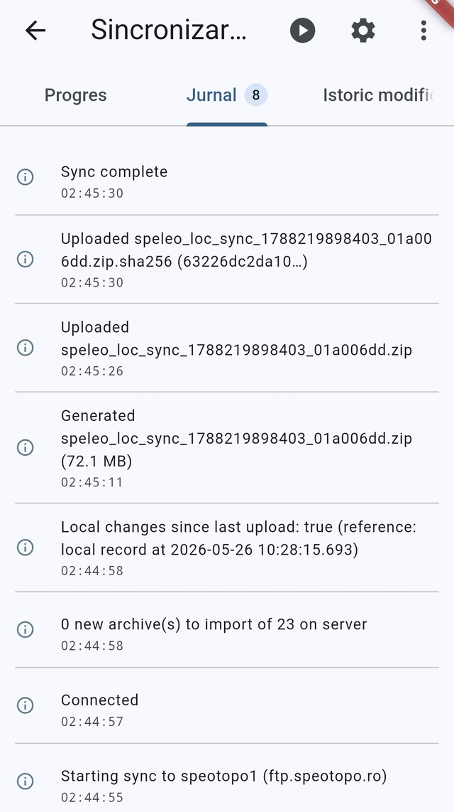

*Fila Jurnal, cu fiecare pas al ultimei sincronizări FTP, cele mai noi primele.*

Fila Jurnal a ecranului Sincronizare FTP arată, în ordine cronologică inversă,
tot ce a făcut sincronizarea, fiecare linie cu ora ei și cu o pictogramă pentru
gravitate (informație, avertisment, eroare). Aici sunt consemnate conectarea la
server, găsirea a 0 arhive noi de importat din cele 23 de pe server, detectarea
modificărilor locale, generarea unei arhive de sincronizare de 72.1 MB,
încărcarea ei împreună cu suma de control .sha256 și, la final, Sincronizare
reușită. Eticheta filei poartă o insignă cu numărul de intrări; când nu e nimic
de arătat, scrie Nicio intrare în jurnal. Această filă se citește pentru a
diagnostica o sincronizare eșuată sau parțială, înainte de a deschide Setări
sincronizare FTP.

Textul de pe ecran (română → engleză)

- Sincronizare FTP — FTP sync (titlu în bara de aplicație, trunchiat)
- Progres — Progress (filă)
- Jurnal 8 — Log (filă, selectată, insignă cu 8 intrări)
- Istoric modificări — Change log (filă)
- linia de jurnal „Starting sync to speotopo1 (ftp.speotopo.ro)”, cu ora ei
- linia de jurnal „Connected”
- linia de jurnal „0 new archive(s) to import of 23 on server”
- linia de jurnal „Local changes since last upload: true (reference: local record at …)”
- linia de jurnal „Generated speleo_loc_sync_….zip (72.1 MB)”
- liniile de jurnal „Uploaded speleo_loc_sync_….zip” și „Uploaded …zip.sha256”
- linia de jurnal „Sync complete”
- pictograma de informație de pe fiecare rând, care marchează nivelul din jurnal
- Pornește sincronizarea — Start sync (pictogramă play în bara de aplicație)
- Setări sincronizare FTP — FTP sync settings (pictogramă rotiță în bara de aplicație)

**Descris în:** [Sincronizare FTP](../features/ftp-sync.md)

---

## Fila istoric modificări în timpul unei sincronizări

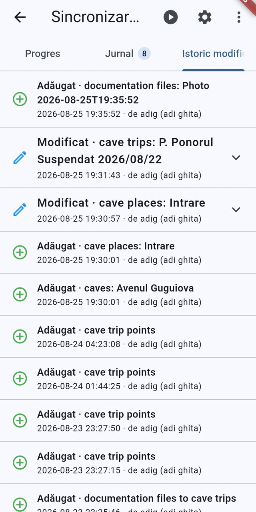

*Fila Istoric modificări, care auditează modificările locale ale înregistrărilor
înainte ca ele să fie sincronizate.*

A treia filă a ecranului Sincronizare FTP înglobează Istoric modificări, o urmă
de audit doar pentru citire a fiecărei modificări de înregistrare făcute pe
acest dispozitiv. Fiecare rând este etichetat Adăugat, Modificat sau Șters,
numește tabelul și înregistrarea afectate (cave places, caves, cave trips, cave
trip points, documentation files) și poartă ora modificării, plus de
<utilizator>. Rândurile de editare au o săgeată care desfășoară câmpurile
schimbate, cu valorile lor vechi și noi. Este aceeași listă la care se ajunge
din Setări, arătată aici ca să vedeți ce urmează să trimită o sincronizare.
Lista e goală până se schimbă ceva, iar atunci scrie Nu există modificări
înregistrate.

Textul de pe ecran (română → engleză)

- Sincronizare FTP — FTP sync (titlu în bara de aplicație, trunchiat)
- Progres — Progress (filă)
- Jurnal 8 — Log (filă)
- Istoric modificări — Change log (filă, selectată)
- Adăugat — Added (rânduri cu plus verde, de ex. „cave places: Intrare”, „caves: Avenul Guguiova”, „cave trip points”, „documentation files”)
- Modificat — Edited (rânduri cu creion albastru, de ex. „cave trips: P. Ponorul Suspendat 2026/08/22”)
- de adig (adi ghita) — by <user> (autorul afișat în subtitlul fiecărui rând)
- ora pe fiecare rând (data și ora modificării)
- săgeata de pe rândurile modificate, care desfășoară valorile câmpurilor schimbate
- Pornește sincronizarea — Start sync (pictogramă play în bara de aplicație)
- Setări sincronizare FTP — FTP sync settings (pictogramă rotiță în bara de aplicație)

**Descris în:** [Sincronizare și istoric modificări](../features/sync-and-change-log.md) · [Sincronizare FTP](../features/ftp-sync.md)

---

## O intrare de istoric desfășurată

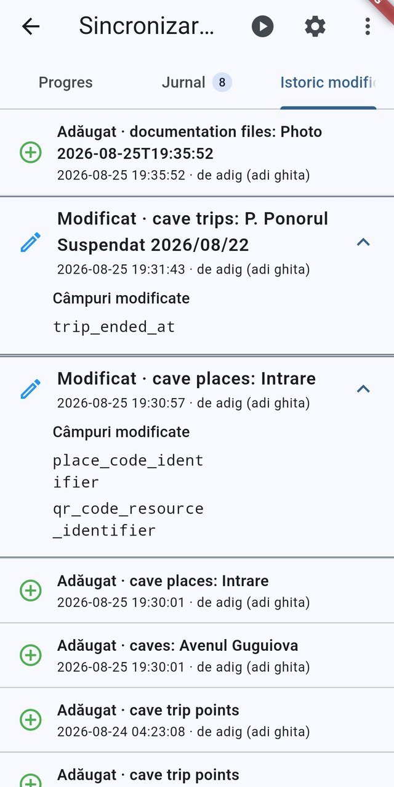

*Fila Istoric modificări a ecranului Sincronizare FTP, cu modificările
înregistrate.*

Aceasta este a treia filă a ecranului Sincronizare FTP, care înglobează lista de
istoric. Fiecare rând arată o insignă de operație (Adăugat, Modificat sau
Șters), cu tabelul și titlul înregistrării, momentul și utilizatorul care a
făcut modificarea. Rândurile de editare se pot desfășura cu săgeata, ca să apară
un bloc Câmpuri modificate care numește exact coloanele diferite, precum
trip_ended_at sau place_code_identifier. Bara de aplicație păstrează la îndemână
Pornește sincronizarea, Setări sincronizare FTP și meniul suplimentar cât timp
răsfoiți istoricul.

Textul de pe ecran (română → engleză)

- Sincronizare FTP — FTP sync (titlu în bara de aplicație, trunchiat)
- Progres — Progress (filă)
- Jurnal — Log (filă, cu o insignă de 8 intrări)
- Istoric modificări — Change log (filă, selectată)
- Adăugat — Added (rânduri de modificare, pictogramă plus verde)
- Modificat — Edited (rânduri de modificare, pictogramă creion albastru)
- Câmpuri modificate — Fields changed (titlul detaliului desfășurat)
- de — by (prefixul autorului pe fiecare rând, de ex. „de adig (adi ghita)”)
- Pornește sincronizarea — Start sync (pictogramă play în bara de aplicație)
- Setări sincronizare FTP — FTP sync settings (pictogramă rotiță în bara de aplicație)

**Descris în:** [Sincronizare și istoric modificări](../features/sync-and-change-log.md) · [Sincronizare FTP](../features/ftp-sync.md)

---

[← Înapoi la indexul capturilor](README.md)
