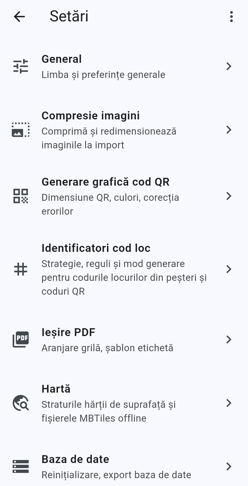
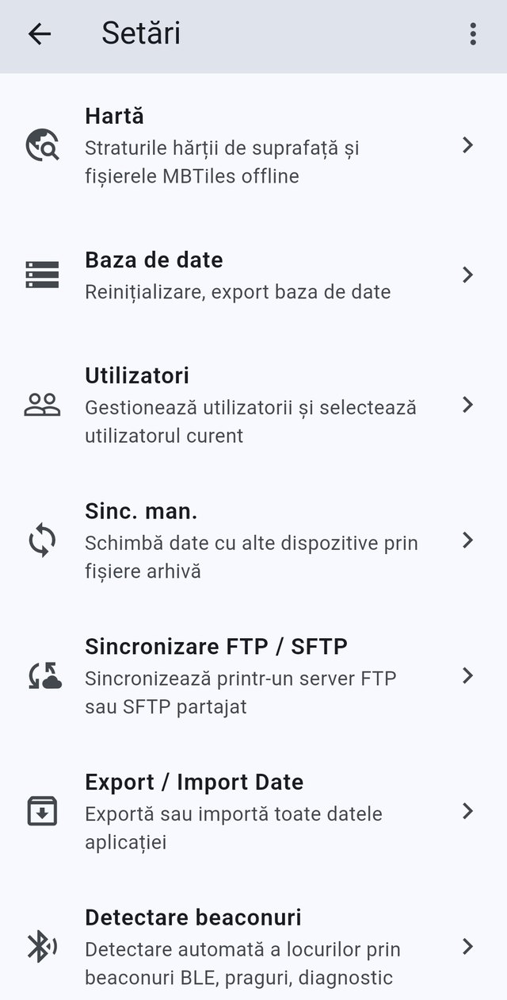
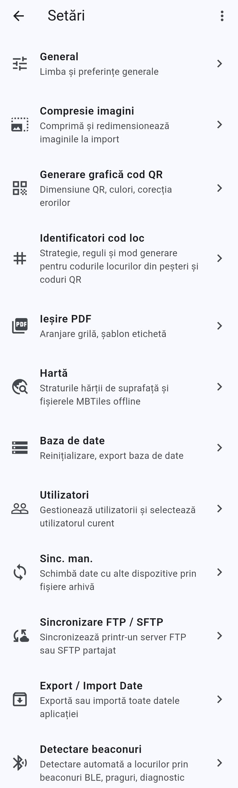

# Setări

[← Galerie de capturi de ecran](README.md) · [← Înapoi la cuprins](../README.md)

Arborele de setări care guvernează codurile, hărțile, imaginile,
sincronizarea și baza de date.

> Aplicația rulează implicit în **română**, așa că în capturi apar etichetele
> românești. Fiecare intrare scrie formularea de pe ecran alături de
> echivalentul ei în engleză.

**Pe această pagină:** [Lista de setări, sus](#settings-main-top) · [Lista de setări, jos](#settings-main-bottom) · [Întreaga listă de setări](#settings-main-full)

---

## Lista de setări, sus

*Partea de sus a listei Setări, de la General până la Baza de date.*

Ecranul principal Setări înșiră fiecare zonă de configurare ca un rând
apăsabil, cu un rezumat de un rând al lucrurilor pe care le controlează.
Această captură arată partea de sus a listei: General, Compresie imagini,
Generare grafică cod QR, Identificatori cod loc, Ieșire PDF, Hartă și Baza de
date. Apăsați orice rând pentru a deschide subpagina de setări a zonei
respective; butonul cu trei puncte din bara aplicației deschide meniul general
al aplicației.

Textul de pe ecran (română → engleză)

- Setări — Settings (titlul din bara aplicației)
- General — General / Limba și preferințe generale — Language and general preferences
- Compresie imagini — Image compression / Comprimă și redimensionează imaginile la import — Compress and resize images on import
- Generare grafică cod QR — QR Code Generation / Dimensiune QR, culori, corecția erorilor — QR code size, colors, error correction
- Identificatori cod loc — Place code identifiers / Strategie, reguli și mod generare pentru codurile locurilor din peșteri și coduri QR — Strategy, rules, and QCRI mode for cave place codes
- Ieșire PDF — PDF Output / Aranjare grilă, șablon etichetă — Grid layout, label template
- Hartă — Map / Straturile hărții de suprafață și fișierele MBTiles offline — Surface map layers and offline MBTiles files
- Baza de date — Database / Reinițializare, export baza de date — Reinitialize, export database
- Săgeata Înapoi și meniul cu trei puncte din bara aplicației

**Descris în:** [Setări](../features/settings.md)

---

## Lista de setări, jos

*Setările derulate în jos, până la intrările pentru partajarea datelor și
pentru beaconuri.*

Același ecran Setări, derulat până la jumătatea lui de jos, acolo unde stau
intrările pentru partajarea datelor și pentru echipamente. De aici se deschid
Hartă, Baza de date, Utilizatori, Sinc. man. (schimb de date cu alte
dispozitive prin fișiere arhivă), Sincronizare FTP / SFTP, Export / Import
Date și Detectare beaconuri. Detectare beaconuri este ultimul rând al listei
într-o versiune de producție; un rând Informații depanare apare sub el doar
când modul de depanare este pornit.

Textul de pe ecran (română → engleză)

- Setări — Settings (titlul din bara aplicației)
- Hartă — Map / Straturile hărții de suprafață și fișierele MBTiles offline — Surface map layers and offline MBTiles files
- Baza de date — Database / Reinițializare, export baza de date — Reinitialize, export database
- Utilizatori — Users / Gestionează utilizatorii și selectează utilizatorul curent — Manage users and select the current one
- Sinc. man. — Man. sync / Schimbă date cu alte dispozitive prin fișiere arhivă — Exchange data with other devices via archive files
- Sincronizare FTP / SFTP — FTP / SFTP sync / Sincronizează printr-un server FTP sau SFTP partajat — Sync with a shared FTP or SFTP server
- Export / Import Date — Data Export / Import / Exportă sau importă toate datele aplicației — Export or import all application data
- Detectare beaconuri — Beacon detection / Detectare automată a locurilor prin beaconuri BLE, praguri, diagnostic — Automatic place detection via BLE beacons, thresholds, diagnostics

**Descris în:** [Setări](../features/settings.md) · [Sincronizare manuală și istoric modificări](../features/sync-and-change-log.md)

---

## Întreaga listă de setări

*Meniul Setări complet, toate cele douăsprezece categorii într-o singură
captură.*

O captură derulată pe toată înălțimea ecranului Setări, care arată fiecare
categorie deodată, în ordinea în care le prezintă aplicația: General,
Compresie imagini, Generare grafică cod QR, Identificatori cod loc, Ieșire
PDF, Hartă, Baza de date, Utilizatori, Sinc. man., Sincronizare FTP / SFTP,
Export / Import Date și Detectare beaconuri. Fiecare rând poartă o pictogramă,
un titlu și o descriere de un rând a ceea ce configurează subpagina
respectivă, plus o săgeată care arată că se deschide un alt ecran. Este cea
mai potrivită imagine dacă vreți o privire de ansamblu asupra locului în care
stă fiecare setare.

Textul de pe ecran (română → engleză)

- Setări — Settings (titlul din bara aplicației)
- General — General / Limba și preferințe generale — Language and general preferences
- Compresie imagini — Image compression / Comprimă și redimensionează imaginile la import — Compress and resize images on import
- Generare grafică cod QR — QR Code Generation / Dimensiune QR, culori, corecția erorilor — QR code size, colors, error correction
- Identificatori cod loc — Place code identifiers / Strategie, reguli și mod generare pentru codurile locurilor din peșteri și coduri QR — Strategy, rules, and QCRI mode for cave place codes
- Ieșire PDF — PDF Output / Aranjare grilă, șablon etichetă — Grid layout, label template
- Hartă — Map / Straturile hărții de suprafață și fișierele MBTiles offline — Surface map layers and offline MBTiles files
- Baza de date — Database / Reinițializare, export baza de date — Reinitialize, export database
- Utilizatori — Users / Gestionează utilizatorii și selectează utilizatorul curent — Manage users and select the current one
- Sinc. man. — Man. sync / Schimbă date cu alte dispozitive prin fișiere arhivă — Exchange data with other devices via archive files
- Sincronizare FTP / SFTP — FTP / SFTP sync / Sincronizează printr-un server FTP sau SFTP partajat — Sync with a shared FTP or SFTP server
- Export / Import Date — Data Export / Import / Exportă sau importă toate datele aplicației — Export or import all application data
- Detectare beaconuri — Beacon detection / Detectare automată a locurilor prin beaconuri BLE, praguri, diagnostic — Automatic place detection via BLE beacons, thresholds, diagnostics

**Descris în:** [Setări](../features/settings.md)

---

[← Galerie de capturi de ecran](README.md)
