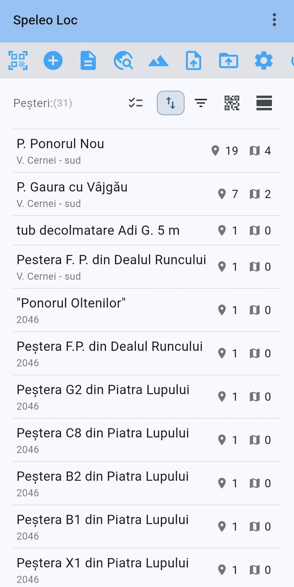
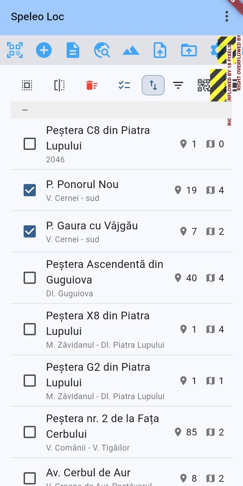
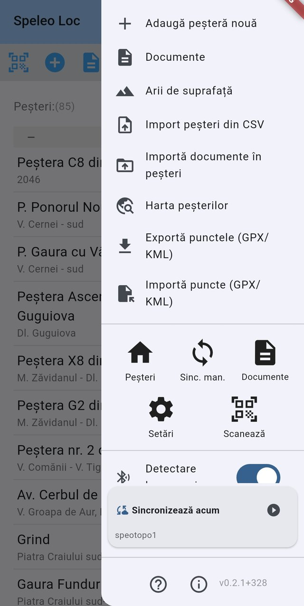
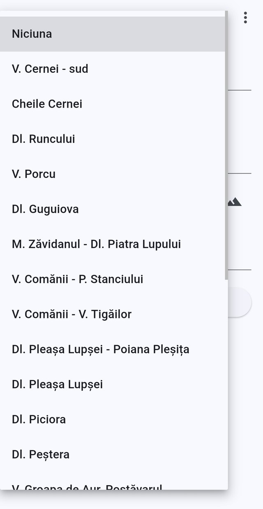
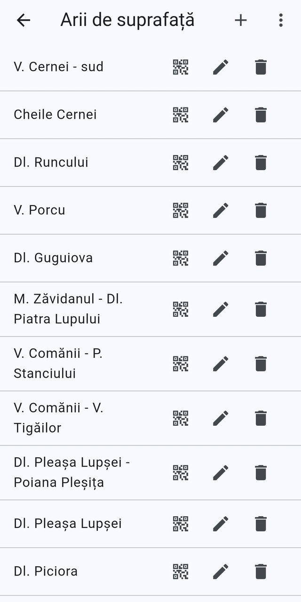
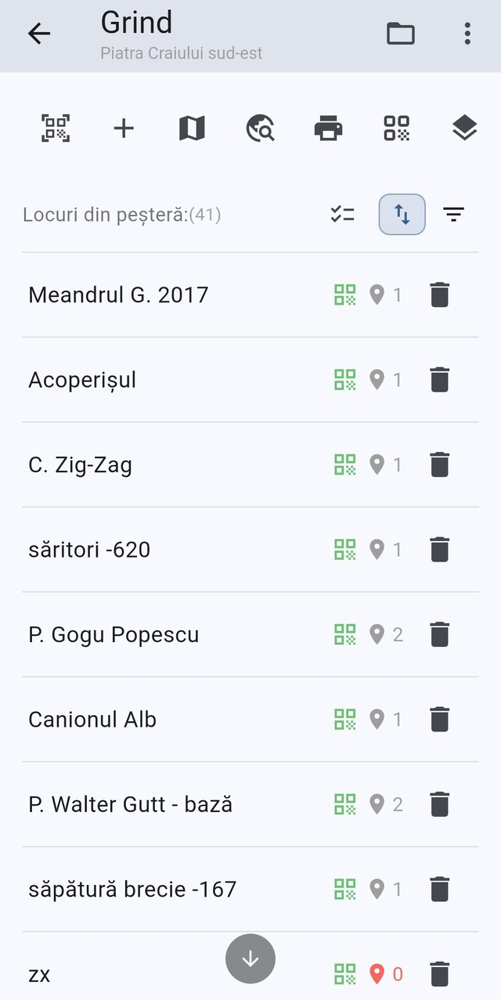

# Home screen, caves and areas

[← Screenshot index](README.md) · [← Wiki index](../README.md)

The entry point of the app, the cave list and the screens that organise caves into surface areas.

> The app runs in **Romanian** by default, so the screenshots show Romanian labels. Each entry lists the on-screen wording next to its English equivalent.

**On this page:** [The home screen and its cave list](#home-cave-list) · [Selection mode on the cave list](#home-cave-list-selection-mode) · [The global menu (end drawer)](#home-global-menu) · [Choosing a surface area for a cave](#cave-form-surface-area-picker) · [Managing surface areas](#surface-areas-list) · [A cave's places list](#cave-places-list)

---

## The home screen and its cave list

*The home screen lists every cave with its place and raster-map counts.*

The home screen is the app's entry point and lists all caves held in the local database. Under the app bar sits the optional action toolbar with Scan QR, Add new cave, Documents, Cave map, Manage surface areas, Import caves - CSV, Import cave documents, Settings and the two sync buttons. The list header shows the "Caves:" label with the current count (31) followed by Selection mode, Sort by (highlighted because a sort is active), Show filter, Generate QR codes for caves, and the toolbar show/hide toggle. Each row gives the cave title, its surface area underneath, and two counters — the pin icon for the number of cave places and the map icon for the number of raster maps; tapping a row opens that cave.

On-screen wording (Romanian → English)

- Speleo Loc — app title in the app bar
- Peșteri:(31) — Caves: (31), list header label with the item count
- Mod selecție — Selection mode (checklist icon)
- Sortează după — Sort by (up/down arrows, highlighted as active)
- Arată filtrul — Show filter
- Generează coduri QR pentru peșteri — Generate QR codes for caves (QR icon)
- Ascunde bara de acțiuni — Hide action toolbar (bar icon)
- Toolbar: Scanează QR — Scan QR
- Toolbar: Adaugă peșteră nouă — Add new cave
- Toolbar: Documente — Documents
- Toolbar: Harta peșterilor — Cave map
- Toolbar: Arii de suprafață — Manage surface areas
- Toolbar: Import peșteri din CSV — Import caves - CSV
- Toolbar: Importă documente în peșteri — Import cave documents
- Toolbar: Setări — Settings
- Toolbar: Sinc. man. — Man. sync (partially visible at the right edge)
- Cave rows with title, surface area subtitle (V. Cernei - sud, 2046) and place / raster-map counters

**Described in:** [Home screen](../features/home-screen.md) · [Caves and areas](../features/caves-and-areas.md)

---

## Selection mode on the cave list

*The home cave list in selection mode, with two caves checked.*

The home screen lists every cave in the local database, each row showing the cave name, its surface area beneath, and two counters: the number of places and the number of raster maps held for that cave. The optional home toolbar is pinned above the list with Scan QR, Add new cave, Documents, Cave map, Manage surface areas, Import caves - CSV, Import cave documents and Settings. Below it the list's own toolbar offers Select all, Invert selection, Delete selected, Selection mode, Sort by (currently active), Show filter and Generate QR codes for caves. Here Selection mode is on, so each row carries a checkbox and two caves are ticked, scoping the toolbar actions to them.

On-screen wording (Romanian → English)

- Speleo Loc — app bar title (app name)
- Scanează QR — Scan QR (toolbar)
- Adaugă peșteră nouă — Add new cave (toolbar)
- Documente — Documents (toolbar)
- Harta peșterilor — Cave map (toolbar)
- Arii de suprafață — Manage surface areas (toolbar)
- Import peșteri din CSV — Import caves - CSV (toolbar)
- Importă documente în peșteri — Import cave documents (toolbar)
- Setări — Settings (toolbar)
- Selectează tot — Select all
- Inversează selecția — Invert selection
- Șterge selectate — Delete selected
- Mod selecție — Selection mode
- Sortează după — Sort by (highlighted as active)
- Arată filtrul — Show filter
- Generează coduri QR pentru peșteri — Generate QR codes for caves
- Cave rows with checkboxes: P. Ponorul Nou and P. Gaura cu Vâjgău checked
- Per-row place count (pin icon) and raster map count (map icon)
- Surface area subtitles, e.g. V. Cernei - sud, Dl. Guguiova

**Described in:** [Home screen](../features/home-screen.md) · [Caves and areas](../features/caves-and-areas.md)

---

## The global menu (end drawer)

*The global end drawer opened from the home screen's overflow button.*

Tapping the overflow button in the app bar slides in the global end drawer. Its upper half holds the screen-specific entries contributed by the home screen — Add new cave, Documents, Manage surface areas, Import caves - CSV, Import cave documents, Cave map, Export places (GPX/KML) and Import places (GPX/KML). Below a divider sits the always-present navigation grid (Caves, Man. sync, Documents, Settings, Scan), then the Beacon detection quick toggle, the FTP sync card showing Sync now with the default profile name underneath, and finally the Help tour and About buttons with the build version.

On-screen wording (Romanian → English)

- Adaugă peșteră nouă — Add new cave
- Documente — Documents
- Arii de suprafață — Manage surface areas
- Import peșteri din CSV — Import caves - CSV
- Importă documente în peșteri — Import cave documents
- Harta peșterilor — Cave map
- Exportă punctele (GPX/KML) — Export places (GPX/KML)
- Importă puncte (GPX/KML) — Import places (GPX/KML)
- Peșteri — Caves (navigation grid)
- Sinc. man. — Man. sync (navigation grid)
- Documente — Documents (navigation grid)
- Setări — Settings (navigation grid)
- Scanează — Scan (navigation grid)
- Detectare beaconuri — Beacon detection (quick toggle, switched on)
- Sincronizează acum — Sync now (FTP sync card, profile speotopo1)
- Tur de ghidare — Help tour (question-mark button)
- Despre — About (info button)
- Version label v0.2.1+328

**Described in:** [Home screen](../features/home-screen.md) · [Ftp sync](../features/ftp-sync.md)

---

## Choosing a surface area for a cave

*Choosing the surface area a cave belongs to on the cave form.*

The cave form's Area title (optional) dropdown is open, covering the screen with the list of surface areas defined in the database. None is the first and currently selected entry, so a cave can be saved without belonging to any area; picking a row assigns the cave to that surface area, whose title then appears under the cave in the home list. The mountain button to the right of the dropdown row is Manage surface areas, a shortcut for adding an area that is missing. The rest of the form — Cave title, Description, Cave local index and the Add / Save button — is hidden behind the open list.

On-screen wording (Romanian → English)

- Niciuna — None (first entry, currently selected)
- Dropdown entries: V. Cernei - sud, Cheile Cernei, Dl. Runcului, V. Porcu, Dl. Guguiova, M. Zăvidanul - Dl. Piatra Lupului, V. Comănii - P. Stanciului, V. Comănii - V. Tigăilor, Dl. Pleașa Lupșei - Poiana Pleșița, Dl. Pleașa Lupșei, Dl. Piciora, Dl. Peștera, V. Groapa de Aur-Bostăvarul
- Mountain icon beside the dropdown — Arii de suprafață — Manage surface areas (tooltip)
- ⋮ app bar overflow menu, partly visible beside the popup
- Form field underlines and the rounded Adaugă / Salvează — Add / Save button behind the popup

**Described in:** [Caves and areas](../features/caves-and-areas.md) · [Surface areas](../features/surface-areas.md)

---

## Managing surface areas

*The surface areas list, where regions that group caves are created and edited.*

The Manage surface areas screen lists every named surface region used to group caves, one row per area with its optional description underneath. The app bar's plus button opens Add surface area (title, general area identifier, description), and the overflow menu offers Show generate icons, which reveals an extra per-row Generate codes button. Each row ends with Generate entrance QR codes (range), Edit and Delete; deleting an area leaves its caves in place but unassigned.

On-screen wording (Romanian → English)

- Arii de suprafață — Manage surface areas (app bar title)
- + button — Adaugă arie de suprafață — Add surface area
- ⋮ overflow menu — Afișează pictogramele de generare — Show generate icons
- Row QR icon — Generează coduri QR de intrare (interval) — Generate entrance QR codes (range)
- Row pencil icon — Editează — Edit
- Row bin icon — Șterge — Delete
- Area rows: V. Cernei - sud, Cheile Cernei, Dl. Runcului, V. Porcu, Dl. Guguiova, M. Zăvidanul - Dl. Piatra Lupului, V. Comănii - P. Stanciului, V. Comănii - V. Tigăilor, Dl. Pleașa Lupșei - Poiana Pleșița, Dl. Pleașa Lupșei, Dl. Piciora

**Described in:** [Surface areas](../features/surface-areas.md) · [Place code identifiers](../features/place-code-identifiers.md)

---

## A cave's places list

*The cave places list for one cave, with its action toolbar and status icons.*

Opening a cave from the home screen shows its places list; the app bar carries the cave title with its surface area underneath, a Documents button for files attached to the cave itself, and the screen menu. The action toolbar below offers Scan QR, Add place, View raster maps, Cave map, Print QR codes, Manual QR code search and Cave areas. The Cave places header reports how many places the cave holds (41 here) and hosts Selection mode, Sort by (currently active) and Show filter. Each row shows the place title plus two status icons: a green QR mark when the place has a place code, and a pin with the number of raster maps the place is pinned on — red zero when it is pinned nowhere — followed by Delete cave place.

On-screen wording (Romanian → English)

- Grind — cave title in the app bar
- Piatra Craiului sud-est — the cave's surface area, shown as the app-bar subtitle
- Documente — Documents (folder icon in the app bar)
- Overflow (three-dot) screen menu
- Scanează QR — Scan QR
- Adaugă loc — Add place (plus icon)
- Vezi hărți — View raster maps (folded-map icon)
- Harta peșterilor — Cave map (globe-with-magnifier icon)
- Printează coduri QR — Print QR codes (printer icon)
- Căutare manuală cod QR — Manual QR code search (QR icon)
- Zonele peșterii — Cave areas (stacked-sheets icon)
- Locuri din peșteră:(41) — Cave places, with the place count
- Mod selecție — Selection mode (checklist icon)
- Sortează după — Sort by (up/down arrows, highlighted as active)
- Arată filtrul — Show filter (filter icon)
- Place rows: Meandrul G. 2017, Acoperișul, C. Zig-Zag, săritori -620, P. Gogu Popescu, Canionul Alb, P. Walter Gutt - bază, săpătură brecie -167, zx
- Green QR icon per row — the place has a place code identifier
- Pin icon with a count per row — Definiții hărți / Raster maps definitions; red 0 means the place is not pinned on any raster map
- Șterge locul din peșteră — Delete cave place (trash icon on each row)
- Scroll-to-bottom button floating over the list

**Described in:** [Cave places](../features/cave-places.md) · [Caves and areas](../features/caves-and-areas.md)

---

[← Screenshot index](README.md)
