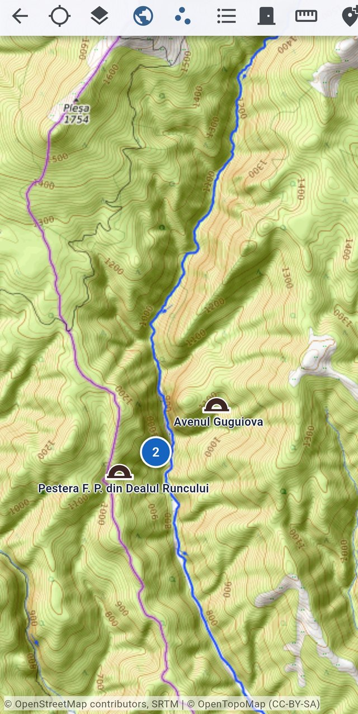
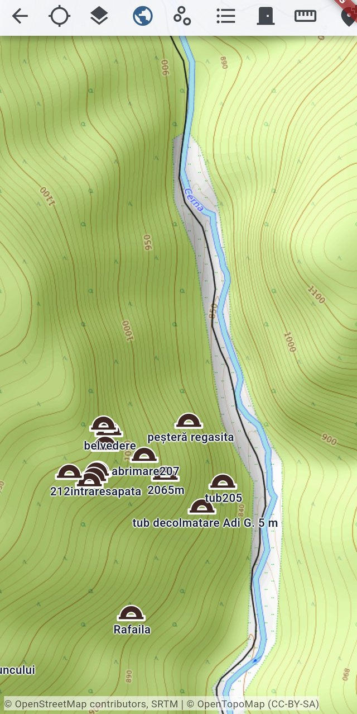
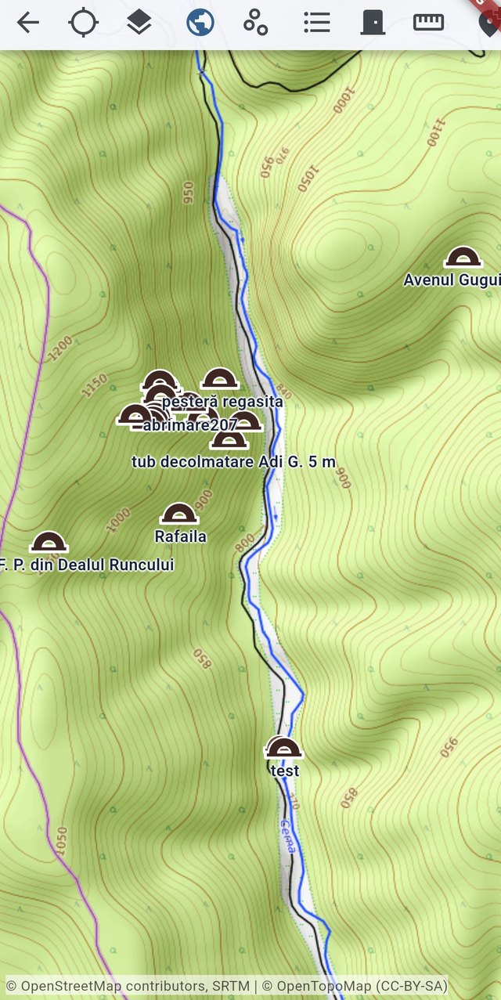
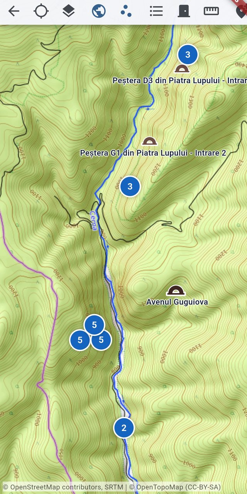
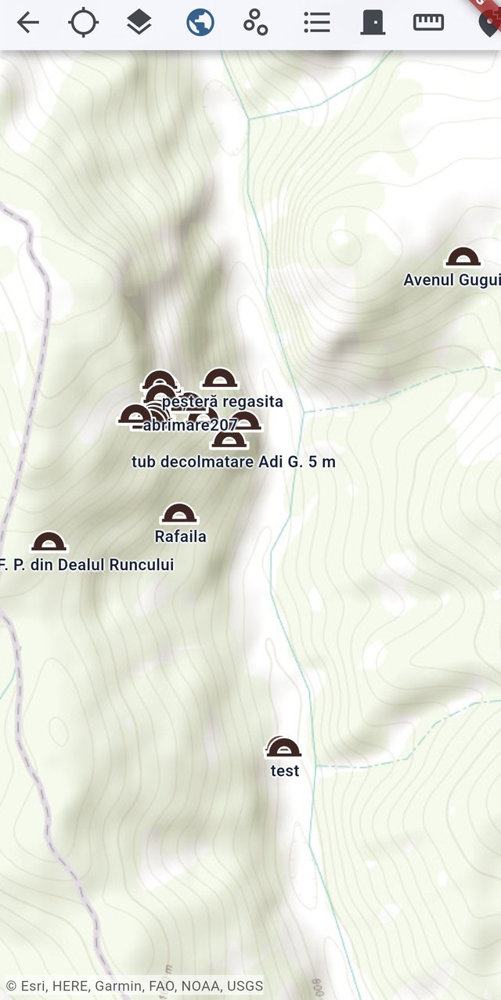
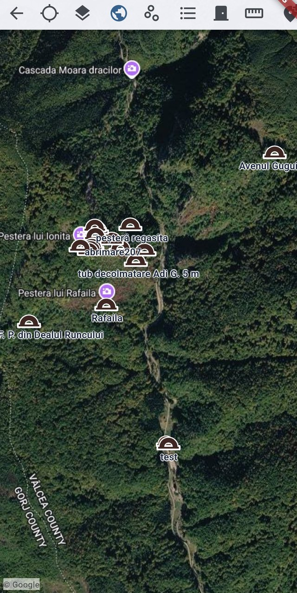
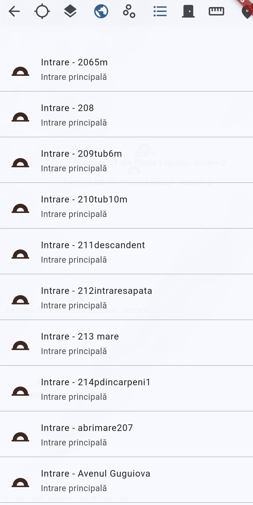
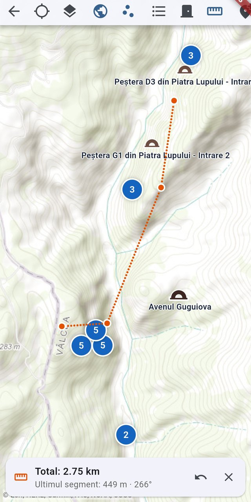
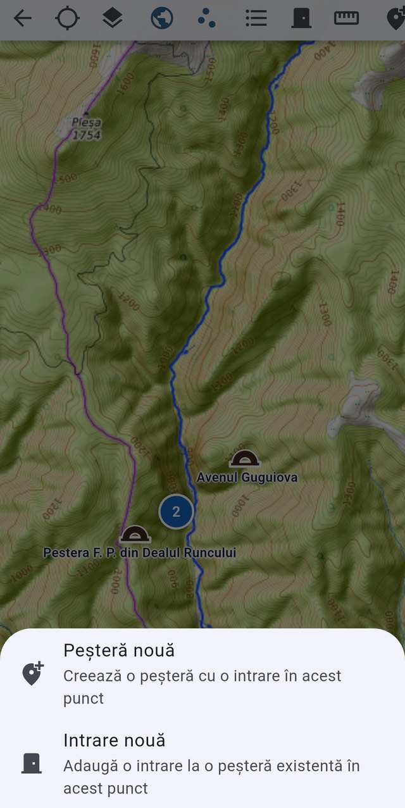
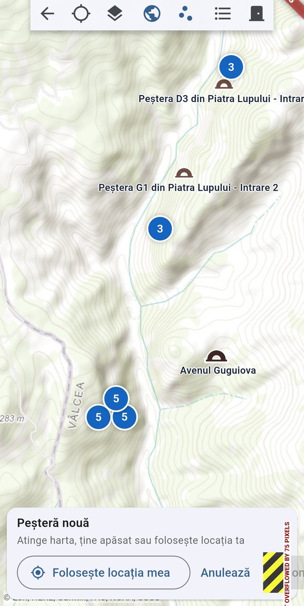

# The cave map

[← Screenshot index](README.md) · [← Wiki index](../README.md)

The full-screen geographic map that plots every cave place carrying GPS coordinates.

> The app runs in **Romanian** by default, so the screenshots show Romanian labels. Each entry lists the on-screen wording next to its English equivalent.

**On this page:** [The cave map on a topographic base layer](#cave-map-topo-entrances) · [Decluttered entrance labels](#cave-map-decluttered-labels) · [Zoomed out over a whole massif](#cave-map-zoomed-out) · [Marker clustering below zoom 14](#cave-map-clusters) · [Entrance waymarks up close](#cave-map-entrance-markers) · [Switching to a satellite base layer](#cave-map-satellite-layer) · [The all-places panel](#cave-map-all-places-panel) · [Measuring a distance on the map](#cave-map-measure-distance) · [Adding a cave or an entrance from the map](#cave-map-add-point-menu) · [Placing the point for a new cave](#cave-map-new-cave-placement)

---

## The cave map on a topographic base layer

*The surface map showing cave entrances on a topographic base layer.*

The full-screen surface map plots every cave place that has GPS coordinates on a topographic base layer; it has no app bar, so a compact toolbar sits directly on top of the map. Two entrances are drawn with the cave-arch waymark and labelled (Avenul Guguiova, Pestera F. P. din Dealul Runcului), while the blue bubble marked 2 is a marker cluster that zooms onto its members when tapped. From the toolbar the user can recentre on My location, open Map layers, toggle Hide places from other caves and Hide non-entrance places (both active here, shown in blue), open the All cave places or Entrances panels, start Measure distance, or use Add point. Map attribution for OpenStreetMap, SRTM and OpenTopoMap runs along the bottom edge.

On-screen wording (Romanian → English)

- Înapoi — Back (arrow, far left of the toolbar)
- Locația mea — My location (crosshair icon, inactive)
- Straturi hartă — Map layers (stacked-sheets icon)
- Ascunde locurile din alte peșteri — Hide places from other caves (globe toggle, active/blue)
- Ascunde locurile care nu sunt intrări — Hide non-entrance places (scattered-dots toggle, active/blue)
- Toate locurile din peșteri — All cave places (bulleted-list icon)
- Intrări — Entrances (door icon)
- Măsoară distanța — Measure distance (ruler icon)
- Adaugă punct — Add point (add-location pin, at the right edge)
- Entrance markers labelled "Avenul Guguiova" and "Pestera F. P. din Dealul Runcului"
- Blue cluster bubble showing the count "2"
- Attribution line "© OpenStreetMap contributors, SRTM | © OpenTopoMap (CC-BY-SA)"

**Described in:** [Surface map](../features/surface-map.md)

---

## Decluttered entrance labels

*The surface map on OpenTopoMap, entrance waymarks labelled with their cave titles.*

The full-screen surface map has no app bar; a compact toolbar sits directly on the map with Back, My location, Map layers, Hide places from other caves (the globe, highlighted because other caves' places are shown), Show non-entrance places (currently off, so only entrances are drawn), All cave places, Entrances, Measure distance and Add point. The OpenTopoMap base layer is selected, so contour lines and the Cerna valley show behind the markers. Each entrance is a brown cave-arch waymark with a decluttered label carrying the cave title, and where entrances sit metres apart the waymarks overlap into a small stack. Tapping any waymark opens the place info card with its coordinates and a link to the cave place page.

On-screen wording (Romanian → English)

- Înapoi — Back (arrow, leftmost toolbar button)
- Locația mea — My location (crosshair, inactive: no GPS fix being followed)
- Straturi hartă — Map layers (layer stack icon, panel closed)
- Ascunde locurile din alte peșteri — Hide places from other caves (globe, highlighted = other caves' places visible)
- Arată locurile care nu sunt intrări — Show non-entrance places (outlined scatter icon, toggle off)
- Toate locurile din peșteri — All cave places (list panel button)
- Intrări — Entrances (door icon, list panel button)
- Măsoară distanța — Measure distance (ruler)
- Adaugă punct — Add point (pin icon, right edge)
- Cave-entrance waymarks with labels: belvedere, peșteră regasita, abrimare207, 212intraresapata, 2065m, tub205, tub decolmatare Adi G. 5 m, Rafaila
- Tile attribution bar: © OpenStreetMap contributors, SRTM | © OpenTopoMap (CC-BY-SA)

**Described in:** [Surface map](../features/surface-map.md) · [Documenting a new cave](../workflows/documenting-a-new-cave.md)

---

## Zoomed out over a whole massif

*The same surface map zoomed out; crowded labels are dropped by priority.*

The same OpenTopoMap view of the Cerna valley, zoomed out one step so a wider set of caves fits on screen. Label decluttering is visible: the dense group of entrances in the middle keeps only a few labels while isolated entrances such as Avenul Gugui, F. P. din Dealul Runcului, Rafaila and test keep theirs. The toolbar state is unchanged — places from other caves are shown, Show non-entrance places is still off — so every marker on screen is a cave entrance. Panning and pinching the map is all that is needed to move between these two views; the camera position is remembered for the next visit.

On-screen wording (Romanian → English)

- Înapoi — Back (arrow)
- Locația mea — My location (crosshair, inactive)
- Straturi hartă — Map layers
- Ascunde locurile din alte peșteri — Hide places from other caves (globe, highlighted)
- Arată locurile care nu sunt intrări — Show non-entrance places (toggle off)
- Toate locurile din peșteri — All cave places
- Intrări — Entrances
- Măsoară distanța — Measure distance
- Adaugă punct — Add point
- Entrance labels: Avenul Gugui…, peșteră regasita, abrimare207, tub decolmatare Adi G. 5 m, Rafaila, F. P. din Dealul Runcului, test
- Tile attribution bar: © OpenStreetMap contributors, SRTM | © OpenTopoMap (CC-BY-SA)

**Described in:** [Surface map](../features/surface-map.md)

---

## Marker clustering below zoom 14

*The surface map showing cave entrances and clustered places on topographic tiles.*

The Cave map is a full-screen geographic map with no app bar; a compact toolbar floats across the top with Back, My location, Map layers, show/hide other caves, show/hide non-entrance places, All cave places, Entrances, Measure distance and Add point. Cave entrances are drawn as arch waymarks with decluttered labels such as "Peștera D3 din Piatra Lupului - Intrare", "Peștera G1 din Piatra Lupului - Intrare 2" and "Avenul Guguiova", while nearby places collapse into numbered blue cluster bubbles that expand as you zoom in. The base layer here is OpenTopoMap with contour lines, and its attribution is shown along the bottom edge.

On-screen wording (Romanian → English)

- Înapoi — Back
- Locația mea — My location
- Straturi hartă — Map layers
- Ascunde/Arată celelalte peșteri — Hide/Show other caves (globe toggle, active)
- Ascunde/Arată locurile care nu sunt intrări — Hide/Show non-entrance places (scatter toggle)
- Toate locurile din peșteri — All cave places
- Intrări — Entrances
- Măsoară distanța — Measure distance
- Adaugă punct — Add point (partly cut off at the right edge)
- Cave-arch entrance markers with labels: Peștera D3 din Piatra Lupului - Intrare, Peștera G1 din Piatra Lupului - Intrare 2, Avenul Guguiova
- Numbered cluster bubbles (3, 3, 5, 5, 5, 2)
- OpenStreetMap / OpenTopoMap attribution line

**Described in:** [Surface map](../features/surface-map.md)

---

## Entrance waymarks up close

*The surface map plotting cave entrances with decluttered labels over a topographic base layer.*

The full-screen surface map, which has no app bar: a compact toolbar sits directly on the map and the rest of the screen is the topographic base layer with the cave places drawn on it. Each entrance is a cave-arch waymark carrying its label; labels are decluttered by priority, so a single name survives where several markers overlap. Here Hide places from other caves is active (the globe is highlighted) while Show non-entrance places is off, so only entrances are drawn. From this state the user pans and zooms, taps a marker to open its info card, or reaches for Map layers, Measure distance or Add point in the toolbar.

On-screen wording (Romanian → English)

- Înapoi — Back (toolbar arrow)
- Locația mea — My location
- Straturi hartă — Map layers
- Ascunde locurile din alte peșteri — Hide places from other caves (globe, active)
- Arată locurile care nu sunt intrări — Show non-entrance places (inactive)
- Toate locurile din peșteri — All cave places
- Intrări — Entrances
- Măsoară distanța — Measure distance (ruler)
- Adaugă punct — Add point (partly off-screen at the right)
- Cave-arch entrance markers with labels: "pesteră regasita", "abrimare207", "tub decolmatare Adi G. 5 m", "Rafaila", "F. P. din Dealul Runcului", "Avenul Guguiova", "test"
- Base-layer attribution: "© Esri, HERE, Garmin, FAO, NOAA, USGS"

**Described in:** [Surface map](../features/surface-map.md)

---

## Switching to a satellite base layer

*The surface map over Google satellite imagery, same entrances on aerial photography.*

The identical map extent after picking a Google aerial base layer in Map layers, which is useful for reading the terrain around an entrance — slopes, clearings and the stream bed are visible where the topographic layer only draws contours. The app's own markers are unchanged: brown cave-arch waymarks with their cave-title labels, with Hide places from other caves active and Show non-entrance places off. The purple camera pins and names such as Pestera lui Ionita, Pestera lui Rafaila and Cascada Moara dracilor, plus the county boundary, are part of the imagery provider's tiles rather than SpeleoLoc data. The © Google attribution replaces the OpenTopoMap credit in the bottom bar.

On-screen wording (Romanian → English)

- Înapoi — Back (arrow)
- Locația mea — My location (crosshair, inactive)
- Straturi hartă — Map layers (used to switch to the Google aerial base layer)
- Ascunde locurile din alte peșteri — Hide places from other caves (globe, highlighted)
- Arată locurile care nu sunt intrări — Show non-entrance places (toggle off)
- Toate locurile din peșteri — All cave places
- Intrări — Entrances
- Măsoară distanța — Measure distance
- Adaugă punct — Add point
- App entrance labels: Avenul Gugui…, peșteră regasita, abrimare207, tub decolmatare Adi G. 5 m, Rafaila, F. P. din Dealul Runcului, test
- Provider tile labels (not app data): Cascada Moara dracilor, Pestera lui Ionita, Pestera lui Rafaila, VALCEA COUNTY / GORJ COUNTY
- Tile attribution bar: © Google

**Described in:** [Surface map](../features/surface-map.md)

---

## The all-places panel

*The All cave places panel listing every mapped place, sorted alphabetically.*

The All cave places panel, opened from the surface map toolbar and expanded inline over the map rather than as a dialog. Every cave place with coordinates is listed alphabetically as "<place> - <cave>", with a cave-arch icon and a Main entrance or Entrance subtitle where the place is one. Tapping a row closes the panel and flies the map to that place. The Entrances button beside it opens the same list narrowed to entrances only.

On-screen wording (Romanian → English)

- Toate locurile din peșteri — All cave places (list button, active)
- Intrări — Entrances (list button, inactive)
- Ascunde locurile din alte peșteri — Hide places from other caves (globe, active)
- Arată locurile care nu sunt intrări — Show non-entrance places (inactive)
- Straturi hartă — Map layers
- Locația mea — My location
- Măsoară distanța — Measure distance
- Row titles "<place> - <cave>": "Intrare - 2065m", "Intrare - 208", "Intrare - 209tub6m", "Intrare - 210tub10m", "Intrare - 211descandent", "Intrare - 212intraresapata", "Intrare - 213 mare", "Intrare - 214pdincarpeni1", "Intrare - abrimare207", "Intrare - Avenul Guguiova"
- Intrare principală — Main entrance (row subtitle)

**Described in:** [Surface map](../features/surface-map.md)

---

## Measuring a distance on the map

*Measure mode: a multi-leg path on the map with its total distance and bearing.*

Measure distance mode on the surface map, started from the ruler button in the toolbar. Each tap on the map, or on a marker (which snaps to the exact place point), adds a vertex to the orange dotted path. The bottom bar reports the running Total, here 2.75 km, and the Last leg's length and bearing, 449 m at 266 degrees, with Remove last point and Close beside it. The view is zoomed out past the clustering threshold, so nearby places collapse into blue count bubbles that zoom onto their members when tapped, and only unclustered markers keep their labels.

On-screen wording (Romanian → English)

- Măsoară distanța — Measure distance (ruler, active)
- Arată locurile care nu sunt intrări — Show non-entrance places (active, filled)
- Ascunde locurile din alte peșteri — Hide places from other caves (globe, active)
- Total: 2.75 km — Total (map_measure_total)
- Ultimul segment: 449 m · 266° — Last leg (map_measure_leg)
- Șterge ultimul punct — Remove last point (undo arrow)
- Închide — Close (X)
- Blue cluster count bubbles: 3, 3, 5, 5, 5, 2
- Labelled entrance markers: "Peștera D3 din Piatra Lupului - Intrare…", "Peștera G1 din Piatra Lupului - Intrare 2", "Avenul Guguiova"

**Described in:** [Surface map](../features/surface-map.md)

---

## Adding a cave or an entrance from the map

*The Add point menu offering New cave or New entrance at the chosen spot.*

Tapping Add point on the surface map toolbar (or long-pressing the map) opens a bottom sheet that asks what kind of point to place. New cave creates a whole new cave together with its first entrance at that position, and New entrance adds another entrance to a cave that already exists, prompting first for the cave and then for the entrance name. Choosing either option starts the placement flow, where the pin can still be dragged, tapped onto a new spot or averaged from a GPS fix before it is confirmed. The map stays visible and dimmed behind the sheet so the user can see where the point will land.

On-screen wording (Romanian → English)

- Peșteră nouă — New cave (bottom-sheet option, add-location pin icon)
- Creează o peșteră cu o intrare în acest punct — Create a cave with an entrance at this point (subtitle)
- Intrare nouă — New entrance (bottom-sheet option, door icon)
- Adaugă o intrare la o peșteră existentă în acest punct — Add an entrance to an existing cave at this point (subtitle)
- Adaugă punct — Add point (the toolbar button that opened this sheet)
- Ascunde locurile din alte peșteri — Hide places from other caves (globe toggle, still active)
- Ascunde locurile care nu sunt intrări — Hide non-entrance places (dots toggle, still active)
- Dimmed map behind the sheet with the labelled entrances and the "2" cluster bubble

**Described in:** [Surface map](../features/surface-map.md) · [Caves and areas](../features/caves-and-areas.md)

---

## Placing the point for a new cave

*Placing the entrance point for a new cave on the surface map.*

After choosing "New cave" from the add-point menu, the surface map enters placement mode and shows the placement bar at the bottom, headed "New cave". The hint "Tap the map, long-press, or use your location" explains the three ways to set the point; the "Use my location" button starts an averaged GPS capture whose running mean drags the pin as fixes arrive, and "Cancel" abandons the placement. Once a point is set, the bar replaces the hint with the formatted coordinates and enables the Confirm button. While a placement is running the toolbar drops its Measure distance and Add point buttons, which is why it is shorter here than on the plain map.

On-screen wording (Romanian → English)

- Peșteră nouă — New cave (placement bar title)
- Atinge harta, ține apăsat sau folosește locația ta — Tap the map, long-press, or use your location
- Folosește locația mea — Use my location (outlined button)
- Anulează — Cancel (text button)
- Toolbar: Înapoi — Back
- Toolbar: Locația mea — My location
- Toolbar: Straturi hartă — Map layers
- Toolbar: Ascunde locurile din alte peșteri — Hide places from other caves (globe toggle, active)
- Toolbar: Ascunde locurile care nu sunt intrări — Hide non-entrance places
- Toolbar: Toate locurile din peșteri — All cave places
- Toolbar: Intrări — Entrances
- Map labels: Peștera D3 din Piatra Lupului - Intrare…, Peștera G1 din Piatra Lupului - Intrare 2, Avenul Guguiova

**Described in:** [Surface map](../features/surface-map.md) · [Documenting a new cave](../workflows/documenting-a-new-cave.md)

---

[← Screenshot index](README.md)
