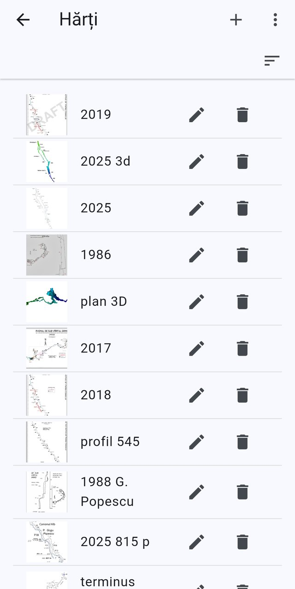
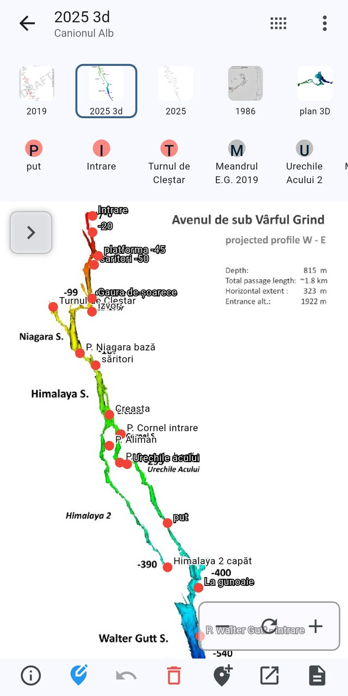
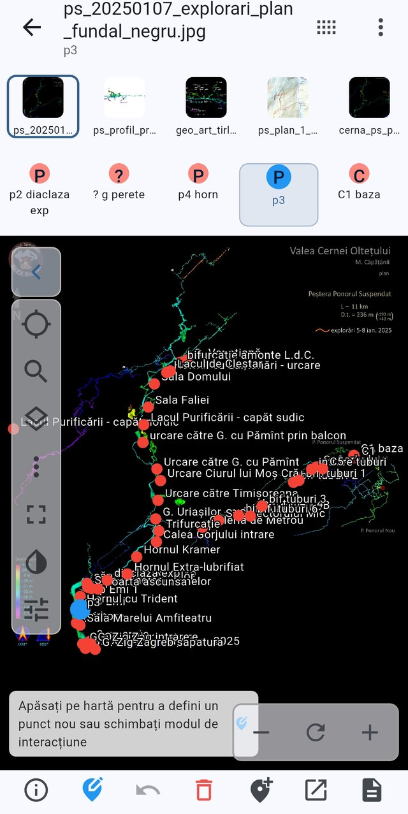
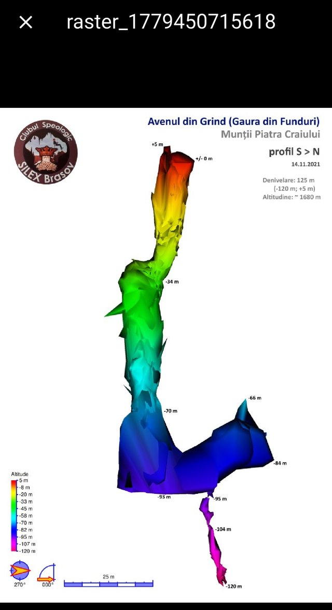

# Raster maps and point placement

[← Screenshot index](README.md) · [← Wiki index](../README.md)

Scanned cave maps, and the editor that pins cave places onto them.

> The app runs in **Romanian** by default, so the screenshots show Romanian labels. Each entry lists the on-screen wording next to its English equivalent.

**On this page:** [A cave's raster maps](#cave-raster-maps-list) · [The raster map place selector](#raster-map-place-selector) · [Defining a point on a raster map](#raster-map-define-point) · [A raster map in the full-screen viewer](#raster-map-full-screen)

---

## A cave's raster maps

*The Raster maps list for a cave, with per-map edit and delete actions.*

This screen lists every raster map registered for the current cave, each row showing a thumbnail of the map image and its title. Tapping a row opens the map full-screen; the pencil opens Edit raster map and the bin runs Delete raster map, which warns first when point definitions exist on that map. The app bar carries Add raster map, and the sort button in the strip below it switches the list into Reorder maps mode so entries can be dragged into the order used elsewhere in the app.

On-screen wording (Romanian → English)

- Hărți — Raster maps (app bar title)
- Adaugă hartă — Add raster map (+ icon in app bar)
- Reordonare hărți — Reorder maps (sort icon in the toolbar strip)
- Editează harta — Edit raster map (pencil icon on each row)
- Șterge harta — Delete raster map (bin icon on each row)
- Map rows with thumbnail and title: 2019, 2025 3d, 2025, 1986, plan 3D, 2017, 2018, profil 545, 1988 G. Popescu, 2025 815 p, terminus

**Described in:** [Raster maps](../features/raster-maps.md)

---

## The raster map place selector

*Placing cave places on a raster map with the map and place navigation bars.*

The raster map place selector shows one raster map full-screen with every cave place that has a point definition drawn on it as a labelled red pin. The app bar names the selected map with the selected cave place beneath it; the two strips above the image are the Show maps list row of map thumbnails and the Show cave places list row of place chips, either of which switches the view without leaving the screen. The bottom bar holds Toggle legend, the tap-mode switch (Tap mode: Define new point), Reset point to initial position, Remove point definition, Quick add cave place, Open cave place and Documents. The chevron at the left edge reveals the side toolbar, and the floating controls at the lower right reset and zoom the image.

On-screen wording (Romanian → English)

- 2025 3d — selected raster map title (app bar)
- Canionul Alb — selected cave place title (app bar subtitle)
- Comutare navigare compactă — Toggle compact navigation (app bar icon)
- Afișează lista hărților — Show maps list (thumbnail strip: 2019, 2025 3d, 2025, 1986, plan 3D)
- Afișează lista locurilor — Show cave places list (chips: put, Intrare, Turnul de Cleștar, Meandrul E.G. 2019, Urechile Acului 2)
- Comutare legendă — Toggle legend (info icon, bottom bar)
- Mod atingere: Definește punct nou — Tap mode: Define new point (blue pin icon, bottom bar)
- Resetează punctul la poziția inițială — Reset point to initial position (undo icon)
- Elimină definiția punctului — Remove point definition (red bin icon)
- Adăugare loc peșteră — Quick add cave place (add-location icon)
- Deschide locul — Open cave place (open-in-new icon)
- Documente — Documents (document icon)
- Afișează bara de instrumente — Show toolbar (chevron at the left edge of the map)

**Described in:** [Map viewer](../features/map-viewer.md) · [Raster maps](../features/raster-maps.md)

---

## Defining a point on a raster map

*Placing cave places on a scanned survey with the raster map point editor.*

This is the raster map place selector, where a scanned cave survey is used to give cave places their position on the map. The top nav bar holds a strip of the cave's raster maps and, under it, a strip of cave places (the selected one, p3, is repeated under the app bar title); tapping a place makes it the one being positioned. The floating hint reads "Click on the map to define a new point or change the interaction mode", and the bottom action bar carries Toggle legend, the tap-mode toggle (currently Tap mode: Define new point), Reset point to initial position, Remove point definition, Quick add cave place, Open cave place and Documents. The collapsible left-hand toolbar adds Next place without location, Filter cave places, Nav bar views, More actions, full screen, colour inversion and Image processing, over a depth colour scale.

On-screen wording (Romanian → English)

- Apăsați pe hartă pentru a defini un punct nou sau schimbați modul de interacțiune — Click on the map to define a new point or change the interaction mode
- App bar title = raster map file name, subtitle = selected cave place (p3)
- Raster map thumbnail strip (ps_202501…, ps_profil_pr…, geo_art_tirl…, ps_plan_1_…, cerna_ps_p…)
- Cave place chips: p2 diaclaza exp, ? g perete, p4 horn, p3 (selected), C1 baza
- Bottom bar info icon — Comutare legendă — Toggle legend
- Bottom bar blue pin icon — Mod atingere: Definește punct nou — Tap mode: Define new point
- Bottom bar undo icon — Resetează punctul la poziția inițială — Reset point to initial position
- Bottom bar red bin icon — Elimină definiția punctului — Remove point definition
- Bottom bar add-pin icon — Adăugare loc peșteră — Quick add cave place
- Bottom bar open-in-new icon — Deschide locul — Open cave place
- Bottom bar document icon — Documente — Documents
- Left toolbar target icon — Următorul loc fără coordonate — Next place without location
- Left toolbar search icon — Filtrare locuri peșteră — Filter cave places
- Left toolbar layers icon — Vizualizare bară navigație — Nav bar views
- Left toolbar ⋮ — Mai multe acțiuni — More actions
- Left toolbar chevron — Ascunde bara de instrumente — Hide toolbar, plus full-screen toggle
- Left toolbar contrast icon — invert colours; sliders icon — Procesare imagine — Image processing
- Zoom out / reset view / zoom in buttons and depth colour scale on the map
- Red pins with cave place labels overlaid on the survey drawing

**Described in:** [Map viewer](../features/map-viewer.md) · [Raster maps](../features/raster-maps.md)

---

## A raster map in the full-screen viewer

*A cave raster map opened full screen for pinch-zoom inspection.*

Tapping a raster map in a cave's raster map list (or the preview thumbnail in the raster map form) opens the image full screen on a black background, with the map's title in the app bar and a close button to return. The image itself is a pinch-to-zoom, pan-and-drag photo view, so a scanned survey sheet stays readable at any zoom level. Here the loaded map is a coloured depth profile of Avenul din Grind with its altitude legend, north indicator and 25 m scale bar. Nothing can be edited from this view; point placement happens in the map viewer instead.

On-screen wording (Romanian → English)

- App bar title showing the raster map's own title — here the auto-generated name "raster_1779450715618"
- Close (X) button, top left — dismisses the full-screen route
- Pinch-to-zoom / pan image area on a black background
- Survey drawing content (not app UI): "Avenul din Grind (Gaura din Funduri)", "Munții Piatra Craiului" — cave and mountain-range names on the scan
- "profil S > N" — survey profile direction printed on the scan
- "Denivelare: 125 m" — vertical range; "Altitudine: ~ 1680 m" — altitude, both printed on the scan
- Altitude colour legend and 25 m scale bar drawn on the scan

**Described in:** [Raster maps](../features/raster-maps.md) · [Map viewer](../features/map-viewer.md)

---

[← Screenshot index](README.md)
