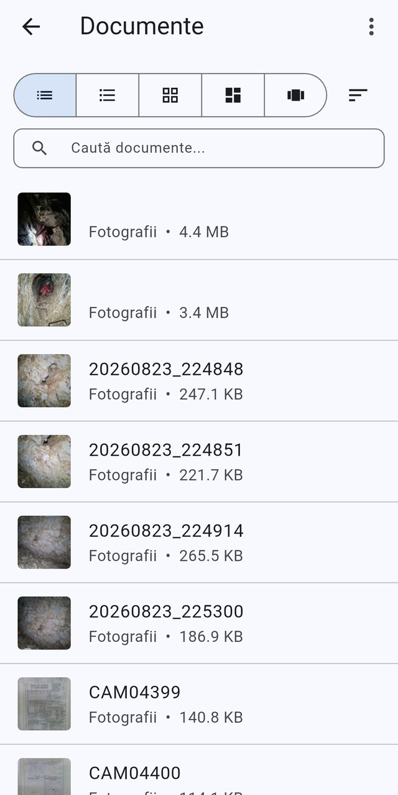
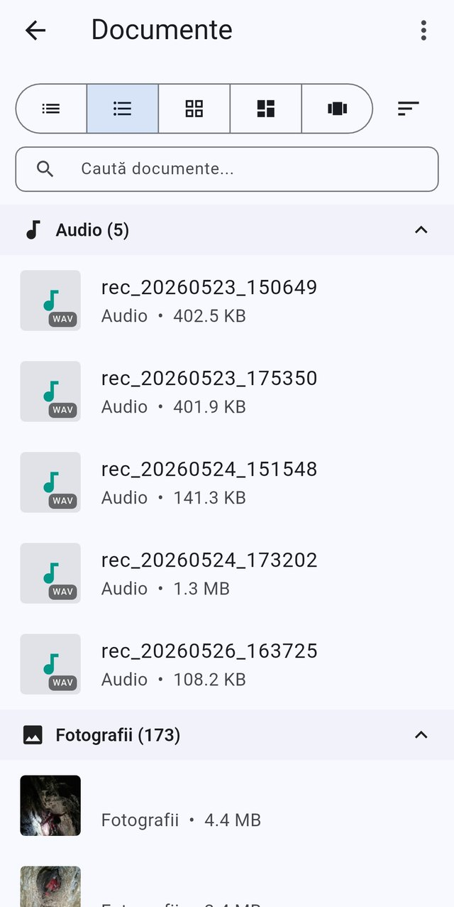
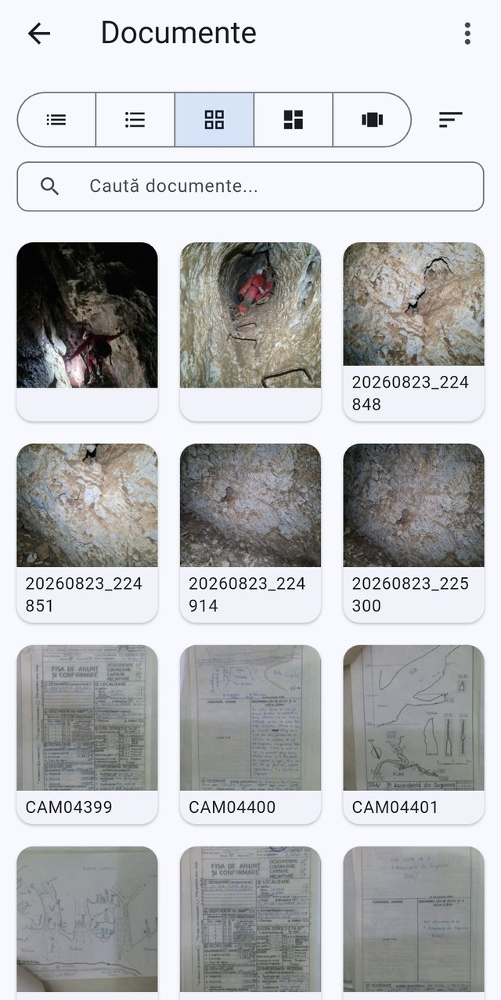
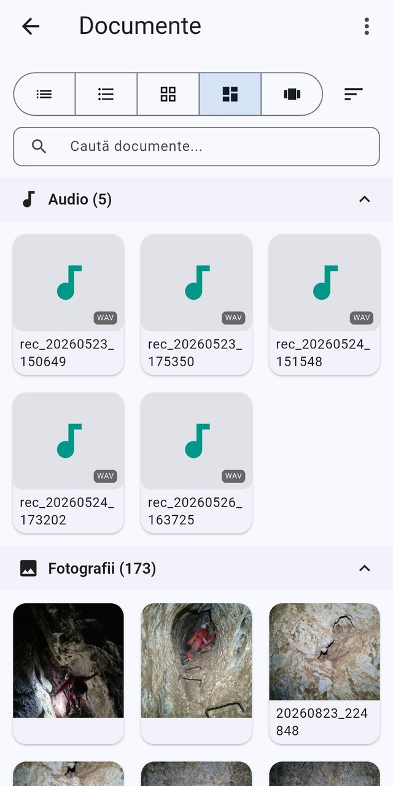
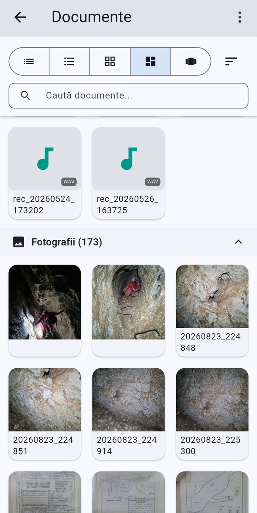

# Documents

[← Screenshot index](README.md) · [← Wiki index](../README.md)

The browser that lists every photo, recording, note and file stored in the app.

> The app runs in **Romanian** by default, so the screenshots show Romanian labels. Each entry lists the on-screen wording next to its English equivalent.

**On this page:** [The documents browser, list view](#documents-list) · [List grouped by category](#documents-list-by-category) · [Grid view](#documents-grid) · [Grid grouped by category — audio](#documents-grid-by-category-audio) · [Grid grouped by category — photos](#documents-grid-by-category-photos)

---

## The documents browser, list view

*The document library in list view, with view-mode selector, sort and search.*

The document library showing every documentation file stored in the app, reached with no geofeature filter so it lists documents from all caves. A pinned header carries a five-way view-mode selector — flat list, list grouped by category, grid, grid grouped by category and a horizontal card row — plus a Sort by menu offering Title, Type, File size and Date, and a Search documents... box that filters as you type. Each row shows a thumbnail, the file title, its category (here Photos) and its size; tapping one opens the matching viewer.

On-screen wording (Romanian → English)

- Documente — Documentation files (app bar title)
- Five-icon view-mode selector: list / list by category / grid / grid by category / horizontal cards (first selected)
- Sort icon — Sort by (menu: Title, Type, File size, Date)
- Caută documente... — Search documents... (search field)
- Fotografii — Photos (document category on each row)
- Document rows with thumbnail, title and file size, e.g. 20260823_224848 · 247.1 KB
- Untitled photo rows showing only category and size, e.g. 4.4 MB

**Described in:** [Documents](../features/documents.md)

---

## List grouped by category

*The all-documents browser in list-by-category view, showing audio recordings and photos.*

This is the global documentation-files browser, opened without a geofeature filter so it lists every document from every cave. The second of the five view-mode buttons is selected, which groups the documents into collapsible category sections — here Audio (5) and Photos (173) — each row showing the file name, its category and its size. A Search documents... field above the list filters by title, file name or description, and the sort button to the right of the view-mode selector reorders the documents by title, type, size or date.

On-screen wording (Romanian → English)

- Documente — Documentation files (app bar title)
- Caută documente... — Search documents... (search field)
- Audio (5) — Audio (5) (collapsible category header with count)
- Fotografii (173) — Photos (173) (collapsible category header with count)
- Five icon-only view-mode buttons: list, list by category (selected), grid, grid by category, horizontal grid
- Sort button (icon only) — Sortează după / Sort by
- List rows with file name, category and file size, e.g. "Audio • 402.5 KB"
- WAV type badge on audio thumbnails
- Overflow menu (three dots) in the app bar

**Described in:** [Documents](../features/documents.md) · [Home screen](../features/home-screen.md)

---

## Grid view

*The same documents browser in flat grid view, showing photo thumbnails.*

The same all-documents browser with the third view-mode button selected, giving a flat three-column grid with no category headers, so photos, scanned cave record sheets and survey sketches appear together in one continuous grid. Each tile shows a thumbnail with the file name underneath, truncated over two lines. The Search documents... field still filters the grid, and the sort button controls the order the tiles appear in.

On-screen wording (Romanian → English)

- Documente — Documentation files (app bar title)
- Caută documente... — Search documents... (search field)
- Five icon-only view-mode buttons with the flat grid one selected
- Sort button (icon only) — Sortează după / Sort by
- Photo thumbnail tiles with file names such as 20260823_224848 and CAM04399
- Scanned cave record sheets and survey sketches shown as document thumbnails
- Overflow menu (three dots) in the app bar

**Described in:** [Documents](../features/documents.md)

---

## Grid grouped by category — audio

*The documents browser in grid-by-category view, with audio tiles above photos.*

The all-documents browser with the fourth view-mode button selected, which keeps the thumbnail grid but splits it into collapsible category sections. The Audio (5) section shows five recordings as tiles with a music-note placeholder and a WAV format badge, and the Photos (173) section below it starts the picture grid. Tapping a section header collapses or expands that category, and the Search documents... field and sort button apply across all sections.

On-screen wording (Romanian → English)

- Documente — Documentation files (app bar title)
- Caută documente... — Search documents... (search field)
- Audio (5) — Audio (5) (collapsible category header with count)
- Fotografii (173) — Photos (173) (collapsible category header with count)
- Five icon-only view-mode buttons with grid by category selected
- Sort button (icon only) — Sortează după / Sort by
- Audio tiles with music-note placeholder, WAV badge and names like rec_20260523_150649
- Photo thumbnail tiles in the Photos section
- Overflow menu (three dots) in the app bar

**Described in:** [Documents](../features/documents.md)

---

## Grid grouped by category — photos

*The global documents browser in Grid by category view, scrolled to the Photos group.*

This is the app-wide documents browser, which lists every documentation file stored in SpeleoLoc rather than the attachments of a single cave or cave place. The pinned header offers five view modes — List, List by category, Grid, Grid by category (selected here) and Horizontal grid — a Sort by menu that orders documents by Title, Type, File size or Date, and a Search documents… field that filters on title, file name and description. Below it the files are grouped under collapsible category headers with a document count: two Audio recordings followed by the Photos (173) group of image thumbnails. Tapping a tile opens the file in its viewer; because this global view is not tied to one cave place, the create/attach toolbar is not shown.

On-screen wording (Romanian → English)

- Documente — Documentation files (app bar title)
- Listă — List (view mode button)
- Listă pe categorii — List by category (view mode button)
- Grilă — Grid (view mode button)
- Grilă pe categorii — Grid by category (view mode button, currently selected)
- Grilă orizontală — Horizontal grid (view mode button)
- Sortează după — Sort by (sort menu icon)
- Caută documente... — Search documents... (search field hint)
- Audio — Audio (category group, two WAV recordings named rec_20260524_173202 and rec_20260526_163725)
- Fotografii (173) — Photos (173) (collapsible category header with document count)
- Photo thumbnails with file-name captions, e.g. 20260823_224848, 20260823_224851, 20260823_224914, 20260823_225300
- Overflow menu button opening the global app menu (top right)

**Described in:** [Documents](../features/documents.md) · [Home screen](../features/home-screen.md)

---

[← Screenshot index](README.md)
